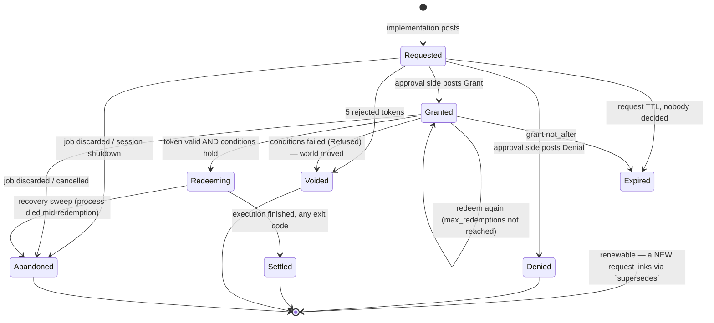

# The kaish approval ledger

**Status:** design proposal, tuned by co-architect pass; cross-model reviewed (gemini-pro + gpt-sol). **The public types and `ToolCtx` API are NOT ready to merge** — see the review synthesis below for the six issues to resolve first.
**Target:** kaish kernel 0.13 · **Drafted:** 2026-08-01 (Opus design agent), tuned + reviewed same day
**Inputs:** [safety-inventory-2026-08.md](safety-inventory-2026-08.md) (problem statement), [../git.md](../git.md) §7 (first consumer), kaish `main` @ `818ff48`
**Reviews:** [reviews/ledger-review-gemini-2026-08.md](reviews/ledger-review-gemini-2026-08.md), [reviews/ledger-review-gpt-2026-08.md](reviews/ledger-review-gpt-2026-08.md)
**Supersedes:** the confirmation latch as a standalone mechanism (see §E)

---

## Cross-model review synthesis (2026-08-01)

Two frontier models reviewed this proposal against the real kaish tree (kaibo
batch, max thinking): gemini-pro said "ship it, fix four blockers"; gpt-sol said
"do not merge the public types yet" and found six. gpt's review was the sharper
one and its blockers are real — they are things this draft genuinely
under-specified, not stylistic quibbles. **The design direction survives intact;
the data model and lifecycle contracts need another pass before any code lands.**
The reviews agree on far more than they differ, and where they agree they are
almost certainly right.

**Adopted — revise the design before PR 3+ (types) and PR 5 (`ToolCtx` API):**

1. **Attempts are first-class (gpt Blocker 1, the most important finding).** The
   §A.5 log keys terminal entries on `RequestId`, but with `max_redemptions > 1`
   two `Redeemed(R)` followed by one `Settled(R)` is unbalanceable — you cannot
   tell which attempt settled. Add an `AttemptId`; `Redeemed`/`Settled`/`Abandoned`
   carry it; redemption becomes a linearizable reserve-a-use operation, and
   settlement is idempotent by `AttemptId`. This is the single change that makes
   the balance rule (§A.1) actually checkable. It also cleanly subsumes the
   background-job lifecycle both reviews flagged.

2. **One explicit linearization contract (gpt Blocker 2).** §B describes race
   *outcomes* but not the *rule*. Adopt gpt's phrasing: "an operation wins by the
   order its conditional ledger transaction commits; every derived event
   (`Expired`/`Voided`/`Abandoned`) has a uniqueness key and is idempotent."
   Standing-grant `max_uses` consumption is part of the same single critical
   section. And **scope the clock claim**: v1 is in-process, one `Arc<LedgerInner>`,
   one monotonic clock, *no durability claim* — the "concurrent kernels sharing a
   ledger" language is too broad and must be narrowed to same-process.

3. **Settlement is a dispatcher-owned guard, not after-return code (both;
   gpt Blocker 3).** §C.1's "the seam posts `Settled` after `tool.execute()`
   returns" does not fire on drop/abort/panic/process-death — verified against
   `kernel.rs:3324-3340`, which only runs on normal return, and
   `ctx.rs:82-101`, whose cancellation is cooperative with no dropped-future
   callback. Replace with an attempt guard whose `Drop` best-effort-settles via a
   synchronous outbox, plus a recovery sweep. **And fix the outcome vocabulary:**
   a cancelled tool may have already written, so the honest terminal is
   `Outcome::Unknown`/`LostExecutor`, not `Cancelled` — "Abandoned" must not imply
   "no effect happened."

4. **The security boundary must be structural, not a redaction convention
   (gpt Blocker 5 — supersedes my §D.3 tuning).** My authority-gated token
   delivery still routes a token *through* the public `ApprovalRequest` and then
   redacts it at a chokepoint — but gpt correctly shows `Job::latch()` is **not** a
   universal chokepoint (foreground results never pass through it;
   `context.rs:759-798` mints the request, `job.rs:223-230` only stamps job-id
   later). The fix is stronger and simpler: the public view is a distinct
   `ApprovalRequestView` type **with no credential field at all** — tokenless by
   construction, so nothing to redact and nothing to leak through clone/JSON/VFS/
   telemetry. The kernel holds the redemption credential internally, bound to
   principal/session; the requester can *trigger* replay after approval but can
   never hold the grant. `with_approval_authority(bool)` becomes a
   non-constructible `ApproverHandle` capability the agent session simply does not
   possess. Also action item: audit that **no shell builtin bridges to
   `Kernel::grant`** (gpt escape-path 4) and soften the threat-model prose to
   "protects against command-level agents and portable tools, not hostile loaded
   Rust or a hostile embedder" (the `as_any_mut` reality, `ctx.rs:106-121`).

5. **Replay needs internal request correlation (gpt Blocker 4).** A bare replay
   re-hits the gate and would post a *new* request. `Kernel::confirm` must reserve
   an attempt for the original request and dispatch with an internal
   `RedemptionContext { request_id, attempt_id }`; the gate matches the fresh
   draft against the granted operation/resources before accepting. Only
   `Exact`-captured invocations are replayable — represent capture status as an
   enum (`Exact`/`Unavailable`/`CaptureFailed`/`DirectExecution`), since
   `kernel.rs:3310-3321` silently substitutes empty argv today.

6. **Migration is resequenced (both; gpt "7a/7b is not safe").** Both reviews
   independently killed the clean rename-then-behavior split: `LatchRequest` is
   `#[serde(deny_unknown_fields)]` (`result.rs:72-74`) and serialized directly, so
   "byte-identical modulo key" only holds for a temporary compat projection, not
   the final tokenless type. Adopt gpt's 7-step sequence: formalize transactions →
   add internal approval types *alongside* the latch → build a latch **compat
   adapter backed by the ledger** (preserving today's TTL/reuse) → port one gate →
   validate fg/pipeline/bg/VFS/trash/CAS → *then* introduce the tokenless wire
   break explicitly → remove the compat layer. Precede it with the
   **operation matrix** gpt specifies (operation × trash × approval × reversible ×
   fg/bg/direct → expected events + failure behavior); the invariant "trash
   failure is loud, never falls through to an unprotected overwrite" is a row that
   must not change.

**Adopted — smaller corrections:**

- **Drop "double-entry" from the name and the code (both reviews, independently).**
  It is not double-entry accounting — there is no trial-balance invariant, and both
  APIs wrap the same `Arc`. It is a **split-authority append-only approval ledger**;
  call it the *approval ledger*. Amy's original framing ("double-entry, simple, not
  crypto, an authorization handoff") is honored by the *split-authority* property,
  which is the part that was ever load-bearing. Keep the intent, drop the label.
- **Spans: linked short spans, not one minutes-long span** (both). Separate
  request / decision-latency / redemption-settlement spans linked by
  `RequestId` + `AttemptId`. Revises §F.
- **`request_approval` returns a richer enum**, not `Result<Auth, ExecResult>`:
  `Authorized(AttemptHandle)` / `Pending(TokenlessView)` / `Denied` / `Unsupported`
  / `LedgerUnavailable`, all non-authorized failing closed (gpt API section).
- **Redemption checks "detect stale authorization," they do not "close TOCTOU"**
  (gpt). The final mutation still needs an atomic conditional write — for git refs,
  git's own compare-and-swap ref update. Reword §B.3's claim.
- **`LedgerSink` backpressure is unspecified** (both). Bounded/buffered async
  channel; on full, fail closed (block new privileged ops) rather than block the
  reactor or drop audit records. New subsection under §D.4.

**The four open questions — reviewers converged (gpt's answers adopted where they
diverge, as the more conservative):**

1. *Ring capacity* → **partitioned retention**: unbounded-ish live index, settled
   chains stream to the sink and evict; fail closed only when *live* entries
   exhaust capacity (with per-principal quotas + metrics against DoS). A
   memory-only v1 is an *operational* ledger, not a durable audit ledger — say so.
2. *Post `fs.*` auto-grants when latch is off?* → **resolved by Amy (2026-08-01):
   neither always nor never — an opt-in, glob-scoped subscription that is free
   when nothing is subscribed.** See "fs.\* observability" below. This also
   settles the reviewers' split: gpt's "don't post by default" is the unsubscribed
   fast path; gemini's "complete record" is what an `observe` subscription buys
   the operator who wants it.
3. *Long-lived span?* → **no**, linked short spans (both agree; already adopted
   above).
4. *`Irreversible` refuse `--confirm`?* → **yes, bind to an approver capability,
   not a bearer token** (both agree). Human REPL keeps the `--confirm` UX because
   it *holds* the capability; an agent-visible token never authorizes an
   irreversible op.

### fs.\* observability — an opt-in, glob-scoped subscription (Amy, 2026-08-01)

The question was "does every `fs.*` op post to the ledger when latch is off." The
answer is **it's configurable, and the default costs nothing**. This resolves the
reviewers' split and, pleasingly, is almost-free mechanism on top of standing
grants.

**The dominant design constraint: free when nothing is subscribed.** A `find`,
`rm -rf`, or `cp -r` over a large tree must not pay a per-path ledger cost unless
an operator has asked for it. Every gate call site (`gate_overwrites` in
`tools/context.rs`, `rm`'s `decide_rm_action`, the trash paths) takes a cheap
early-out *before constructing an `ApprovalRequest` at all*: one relaxed atomic
load answering "are there any fs subscriptions?" — almost always no, branch
predicted, done — and only then a glob match. Nothing is allocated on the
unsubscribed path. This is a hard requirement, not a nice-to-have: kaish's
large-filesystem-job performance is a first-class property and the ledger must
not tax it by default.

**Two subscription modes** — the audit-vs-enforce split, which is the whole point:

- **`observe`** — matching ops post `Requested` + immediate `Granted{Observe}` to
  the sink and proceed; they never defer, never block, never prompt. This is
  "hook everything into an audit log" with no permission semantics. Mechanically
  it is a standing auto-grant with a new `Grounds::Observe` and unlimited uses, so
  it may need no new state-machine surface at all — just the `Grounds` variant and
  the fast-path filter.
- **`enforce`** — matching ops go through the real decision chain (today's
  latch/approval semantics). This is `set -o latch`, re-expressed as a
  subscription over `fs.*`.

**Scope is a glob over (operation-class, resource path)** via `kaish-glob`:
subscribe `fs.write` + `fs.remove` under `/workspace/**` as `observe`, and
everything else — `/tmp/**`, reads, unmatched paths — stays unsubscribed and
free. kaibo's likely posture is to subscribe *nothing* (it allows all reads
within its roots and does not consult an audit log); the capability exists as
proof that kaish *can* give you a complete, typed, structured record of every
filesystem mutation an agent made — which is a genuinely strong story and hard to
get from a normal shell.

**Prior art (Amy's pointer, worth mining at implementation time):**

- **ZFS / Solaris VSCAN** (the `vscan` dataset property + `vscand`): the property
  being *off* means the hook is *not engaged* — zero cost, enforced by the
  property gate rather than a deep runtime branch. That is exactly the
  free-when-unused requirement, and it says the "is anything subscribed" check
  belongs as high up and as cheap as possible. VSCAN also carries a **scanstamp**
  xattr caching a content hash so an unchanged file skips re-scan, plus size and
  file-type exempt lists checked before engaging the engine — the kaish analogs
  are a per-subscription size/kind exempt filter and (later) skipping a re-post
  for state already recorded unchanged.
- **Linux fanotify** is the even-closer analog: it has precisely this split —
  *notification* marks (stream events, non-blocking) versus `FAN_*_PERM`
  *permission* marks (block for a userspace verdict) — and the "you pay only where
  you place a mark" property. A subscription *is* kaish's mark; `observe` is a
  notification mark, `enforce` is a permission mark.

**Implementation note for the revised draft:** this lives on the approval/policy
side as a subscription registry, consulted at the gate before `request_approval`
does any work. Because an `observe` subscription reduces to a standing grant with
`Grounds::Observe`, the incremental mechanism is small: the `Grounds` variant, a
subscription registry with an atomic "any-fs-subscriptions" flag for the fast
path, and the glob filter. It composes with — rather than duplicates — the
standing-grant machinery the ledger already needs. It does **not** change the
`fs.*` default posture the migration ships with (gpt's staging still holds: the
unsubscribed fast path is the default), so it is additive and can land after the
core migration rather than gating it.

**Not adopted / noted:** gemini's PTY-stream-segregation concern (#2 evidence gap)
is real but is an embedder-integration requirement (kaibo/kaijutsu must not blend
the approval prompt into the agent's stdout), not a kernel design change — it
becomes a line in EMBEDDING.md and a note to the embedders. gemini's "double-entry
is dressing" and gpt's "is double-entry the right abstraction" are the same
finding; resolved above.

**Net:** the safety goals, the split-authority separation, the identity/credential
split, redemption-time precondition checks, standing-grants-as-entries, and the
latch-as-consumer endgame all survive. What changes is rigor: attempts, one
linearization rule, a drop-safe settlement guard, a tokenless public view, replay
correlation, and a compat-adapter migration. A revised draft incorporating these
is the next design iteration; **no kernel PR should start from the version below
without the seven adopted revisions folded in.** The original design text is
retained unedited beneath this synthesis so the review citations line up.

---

## 0. The one-paragraph version

Every privileged operation in kaish posts a **request** to an append-only ledger and blocks until a matching **authorization** exists. The implementation side has exactly one call — `ctx.request_approval(req)` — and never learns whether the grant came from a human at a terminal, a standing policy rule, or an embedder's hook. The approval side is the only side that can grant, and it does so by posting its own entry. The books balance when every request that executed has exactly one live grant behind it and every grant that fired has exactly one settlement in front of it. Nothing is cryptographic: the ledger buys *correctness under concurrency, a readable record afterward, and a state machine whose illegal transitions are loud*, not tamper-evidence. Every ledger append is also a tracing event or span, at the same call site, so the audit story and the OTel story are one story.

The existing latch becomes the first consumer: one operation class (`fs.*`), one policy ("ask the human"), the same `--confirm=<token>` UX, the same exit code 2.

### Verification notes against the tree

Claims from the safety inventory re-verified at `818ff48`; refinements worth carrying:

- `generate_nonce` (`crates/kaish-kernel/src/nonce.rs:174-191`) is confirmed non-CSPRNG and folded to `u32` (`hasher.finish() as u32`). `getrandom` is already a direct dependency of `kaish-kernel` (`crates/kaish-kernel/Cargo.toml:64`) — no new dep for the fix.
- `NonceStore` uses `kaish_types::clock::Instant` for TTL (monotonic) but records no wall-clock time at all, so there is nothing to audit *with* even if we added a sink.
- The dispatch-seam capture (`crates/kaish-kernel/src/kernel.rs:3322`) is unconditional and explicitly documented as such — good, because the ledger needs the invocation on *every* request, not just latch-enabled ones.
- `async_trait` is already a dependency of `kaish-tool-api` and `Tool` already uses it (`crates/kaish-tool-api/src/tool.rs:19`). `ToolCtx` does not, but adding `#[async_trait]` to it with **defaulted** async methods is not a breaking change for existing implementors.
- `wait`'s single-latch behavior is at `crates/kaish-kernel/src/tools/builtin/wait.rs:138-140` (`latch.get_or_insert`), with the "first latch wins" comment intact.
- `Scope` has no readonly/pin concept of any kind (`crates/kaish-kernel/src/interpreter/scope.rs:602-608`) — `set +o latch` is a plain setter. Confirmed.

---

## A. The data model

### A.1 What "double entry" honestly means here

Accounting's double entry is *two accounts per transaction, trial balance sums to zero*. The property that makes it trustworthy is not the arithmetic — it is that **the two entries are made from different sides, and neither side can write the other's**. That is the property we want, and it is the property we adapt.

The ledger is one append-only log with **two books** over it, distinguished by who may post to them:

| Book | Posted by | Entries |
|---|---|---|
| **Obligations** | the implementation side (kernel gate sites, plugins via `ToolCtx`) | `Requested`, `Redeemed`, `Settled` |
| **Authorizations** | the approval side (human via REPL, `Approver` hook, standing policy, embedder API) | `Granted`, `Denied`, `StandingIssued`, `StandingRevoked` |
| **Ledger's own** | the ledger, on observation | `Expired`, `Refused`, `Voided`, `Abandoned` |

This is enforced by types, not convention. One log, two handles:

```rust
/// The implementation side's handle. Obtained from ExecContext / ToolCtx.
/// Can post obligations and read everything. CANNOT grant.
#[derive(Clone)]
pub struct Requester(Arc<LedgerInner>);

/// The approval side's handle. Obtained only from `Kernel` (which the embedder
/// owns) or handed to an `Approver`. CANNOT post a request.
#[derive(Clone)]
pub struct Approvals(Arc<LedgerInner>);
```

A tool holding a `&mut dyn ToolCtx` can reach a `Requester` and nothing else. There is no method on it that produces a `Grant`. That is the whole security model, and it is a type error to violate it — which is the standard we want, given that "the agent turns off its own gate" is the failure mode we are actually defending against.

**The balance rule**, stated once, precisely:

> An operation may execute **iff** there exists a chain `Requested(r) → Granted(g)` in the log where `g.request == r.id`, `g` has not expired, `redemptions(g) < g.max_redemptions`, and **every condition in `g.conditions` evaluates true against the world at redemption time**. Redemption appends `Redeemed`; execution appends `Settled{outcome}`.
>
> The books balance when: every `Redeemed` has exactly one live `Granted` ancestor; every `Granted` has exactly one `Requested` ancestor; every `Redeemed` has exactly one terminal successor (`Settled` or `Abandoned`). An unbalanced pair is a kernel bug — `debug_assert!` in debug, `LedgerError::InvariantViolated` in release, and **never** "proceed".

An unmatched *obligation* means the operation must not run. An unmatched *authorization* is fine — it just expires unused, and that shows in the record, which is itself useful signal ("policy grants nobody redeems").

### A.2 Identity vs. credential — the split that makes the record durable

Today's nonce is simultaneously the operation's identity, its secret, and its entire record. That is why the record evaporates: you cannot keep an audit trail keyed on a bearer secret without leaking it, so the only safe thing to do with a nonce is forget it.

Split them:

```rust
/// Public, stable, safe to log, safe to print, safe to keep forever.
/// Format: "{ledger_epoch:8hex}-{seq}" e.g. "9c1a4f2e-42". Short-form
/// ("42") accepted by CLI surfaces when unambiguous within the session.
pub struct RequestId(String);

/// Secret bearer credential. 128 bits from `getrandom`, 32 lowercase hex.
/// Never logged in full; spans record `token_prefix` (first 4 chars) only.
pub struct Token(String);
```

`RequestId` is what the ledger, `/v/approvals`, spans, and every human-readable surface use. `Token` exists only to make `--confirm=<token>` work across a process boundary where the caller cannot be authenticated any other way, and it is dropped from the entry the moment the grant is settled or voided. Where the token *travels* is governed by approval authority — see §D.3, "Token delivery."

### A.3 The request entry

```rust
#[non_exhaustive]
pub struct ApprovalRequest {
    pub id: RequestId,
    /// Dotted taxonomy. In-tree values come from a closed enum (see A.6);
    /// plugins register a namespace prefix at construction ("git.").
    pub operation: OperationId,      // "fs.remove", "trash.empty", "git.push"
    pub risk: RiskClass,             // Reversible | Recoverable | Irreversible
    pub resources: Vec<Resource>,
    pub principal: Principal,        // who is asking
    /// Exact-replay capture from the dispatch seam. `None` for a direct
    /// `tool.execute` (unit test) — such a request is confirmable by token
    /// only, never by `Kernel::confirm`. Same rule as today's `tool`/`argv`.
    pub invocation: Option<Invocation>,   // { tool: String, argv: Vec<String> }
    /// W3C context captured at request time — this is what lets an approval
    /// granted 40 minutes later still nest under the originating trace.
    pub context: RequestContext,     // { traceparent, tracestate, baggage }
    pub job_id: Option<u64>,
    pub reason: String,              // why the gate fired
    pub hint: String,                // display-only re-run string (unchanged semantics)
    pub requested_at: SystemTime,
    pub ttl: Duration,
    /// Set when this request renews an expired predecessor (§B.4).
    pub supersedes: Option<RequestId>,
}
```

**Resource identity that is more than a path.** This is the piece the latch structurally cannot express and git needs:

```rust
#[non_exhaustive]
pub struct Resource {
    /// Namespace of the identifier. In-tree: "path". Plugin-registered:
    /// "git.ref", "git.remote", "git.worktree", "url", "job".
    pub kind: String,
    /// Identifier within that namespace. "/home/a/x.txt", "refs/heads/main",
    /// "origin".
    pub id: String,
    /// The state-transition claim being authorized, when there is one.
    /// This generalizes `cas_overwrite`'s snapshot-compare.
    pub transition: Option<Transition>,
}

pub struct Transition { pub from: StateClaim, pub to: StateClaim }

#[non_exhaustive]
pub enum StateClaim {
    /// The resource does not exist (pre: creating; post: deleting).
    Absent,
    /// An opaque identifier the producer will re-derive at redemption:
    /// a git oid, an etag, a generation number.
    Exact(String),
    /// A content digest. `cas_overwrite`'s prior bytes become a digest here —
    /// the ledger records the *claim*, the gate still holds the bytes.
    Digest { alg: String, hex: String },
    /// "I don't claim anything about this side." Legal, but a grant whose
    /// conditions are all `Unspecified` records that fact so an auditor can
    /// see which approvals were unconditioned.
    Unspecified,
}
```

`git push` becomes: `Resource { kind: "git.ref", id: "refs/heads/main", transition: Some(Transition { from: Exact("a1b2…"), to: Exact("c3d4…") }) }` plus `Resource { kind: "git.remote", id: "origin", transition: None }`. A policy can now say "auto-approve `git.commit` where every `git.ref` matches `refs/heads/agent/*`" without string-matching a display label or re-parsing argv — which is exactly the thing the inventory says an embedder is forced to do today.

**Principal**, the missing "who":

```rust
pub struct Principal { pub id: String, pub kind: PrincipalKind }
#[non_exhaustive]
pub enum PrincipalKind { Agent, Human, Automation, Unknown }
```

Seeded by `KernelConfig::with_principal`, defaulting to `Unknown`. It appears on both the request (who asked) and the grant (who decided). A grant where `decided_by == requested_by` and `kind == Agent` is the self-approval case — refused structurally (§D.3), and visible in the record if an embedder ever configures its way into it.

### A.4 The authorization entry

```rust
#[non_exhaustive]
pub struct Grant {
    pub request: RequestId,
    pub token: Token,
    pub decided_by: Principal,
    pub grounds: Grounds,
    pub not_after: SystemTime,
    /// `Some(1)` is the default for `RiskClass::Irreversible`. `None` means
    /// unlimited within `not_after` — today's reusable-nonce ergonomics,
    /// kept for the retry-idempotency case that motivated it.
    pub max_redemptions: Option<u32>,
    /// Preconditions re-verified at redemption. Defaults to exactly the
    /// transitions declared on the request's resources. An approver may
    /// **narrow** (add or tighten) and may never **widen** — enforced at
    /// post time, loud on violation.
    pub conditions: Vec<Condition>,
    pub decided_at: SystemTime,
}

#[non_exhaustive]
pub enum Grounds {
    /// A human said yes. `channel` distinguishes the REPL terminal from an
    /// embedder's out-of-band UI.
    Human { channel: String },
    /// The embedder's synchronous policy hook.
    Policy { rule: String },
    /// A standing grant already in the ledger fired. Automation is auditable
    /// because the auto-approval names the rule that produced it.
    Standing { grant: StandingId },
    /// The embedder granted directly via `Kernel::grant`.
    Embedder,
}
```

The `Standing` variant is the load-bearing one for "the approval side can automate some". A standing grant is *itself a ledger entry* (`StandingIssued`), and every request it auto-approves produces a normal `Granted` entry naming it. There is no path by which an operation runs without a `Granted` entry, whether a human typed `y` or a rule fired at 3 a.m. That property — one shape of record regardless of provenance — is what makes the ledger worth reading.

### A.5 The entry log

```rust
#[non_exhaustive]
#[derive(serde::Serialize, serde::Deserialize)]
#[serde(tag = "entry", rename_all = "snake_case")]
pub enum LedgerEntry {
    Requested   { seq: u64, at: SystemTime, request: ApprovalRequest },
    Granted     { seq: u64, at: SystemTime, grant: Grant },
    Denied      { seq: u64, at: SystemTime, request: RequestId, by: Principal, reason: String },
    Expired     { seq: u64, at: SystemTime, request: RequestId, what: Expiring },
    Redeemed    { seq: u64, at: SystemTime, request: RequestId, attempt: u32 },
    /// Preconditions no longer hold. Voids the grant. This is `cas_overwrite`'s
    /// "file changed since the gate checked it", generalized.
    Refused     { seq: u64, at: SystemTime, request: RequestId, condition: Condition, found: StateClaim },
    Settled     { seq: u64, at: SystemTime, request: RequestId, outcome: Outcome },
    Abandoned   { seq: u64, at: SystemTime, request: RequestId, reason: String },
    Voided      { seq: u64, at: SystemTime, request: RequestId, reason: String },
    StandingIssued  { seq: u64, at: SystemTime, grant: StandingGrant },
    StandingRevoked { seq: u64, at: SystemTime, id: StandingId, by: Principal, reason: String },
    /// A bad token was presented. Carries the running count; five in a
    /// window voids the request (§E.3).
    TokenRejected   { seq: u64, at: SystemTime, request: Option<RequestId>, attempts: u32 },
}

pub enum Outcome { Exit(i64), Cancelled, Error(String) }
```

`seq` is monotonic per ledger. `at` is wall-clock, from `kaish_types::clock::system_now`, and exists purely for the record — **all expiry math uses `clock::Instant`**, so a wall-clock jump can neither extend nor void a live grant. This is a genuine hazard for a system that intends to hold approvals for minutes-to-hours across a laptop suspend; call it out in the doc comment so nobody "simplifies" it later.

Serde is stable and internally tagged, so an NDJSON sink is the obvious durable form (§D.4).

**Not cryptographic, stated in the type's own docs:** no signatures, no hash chain, no monotonic-counter attestation. Anything running in-process can call the Rust API directly and skip the log entirely. The ledger defends against *accident, drift, forgetfulness, and a confused agent*, and it produces a record you can read afterward. It does not defend against a hostile in-process actor, and pretending otherwise would be the worst thing we could ship.

### A.6 Anti-drift for the operation taxonomy

Follow `classify_command`'s template (`docs/devlog.md:1568-1585`): in-tree operations come from a closed enum, and the mapping from enum to dotted string is an exhaustive match, so **adding a gate site without registering its operation is a compile error**.

```rust
pub enum KernelOperation { FsRemove, FsOverwrite, FsRename, TrashEmpty }
impl KernelOperation { pub const fn id(self) -> &'static str { /* exhaustive match */ } }
```

Plugins get `OperationId::namespaced(prefix, rest)`, where the prefix is registered once at tool-registration time. A plugin that posts `fs.remove` gets a loud rejection — the `fs.` namespace belongs to the kernel. This is cheap and it keeps a policy engine's vocabulary honest.

---

## B. The state machine

### B.1 States

One gated operation, keyed by `RequestId`.



### B.2 The transition table (this is the test matrix)

| From | Event | To | Entry appended | If illegal |
|---|---|---|---|---|
| — | `post_request` | `Requested` | `Requested` | — |
| `Requested` | `grant` | `Granted` | `Granted` | — |
| `Requested` | `deny` | `Denied` | `Denied` | — |
| `Requested` | TTL elapsed (observed) | `Expired` | `Expired{what: Request}` | — |
| `Requested` | `redeem` | ✗ | `TokenRejected` | `LedgerError::NotAuthorized` — exit 1, loud |
| `Granted` | `redeem`, conditions hold | `Redeeming` | `Redeemed{attempt}` | — |
| `Granted` | `redeem`, condition fails | `Voided` | `Refused` + `Voided` | operation must re-request |
| `Granted` | `redeem`, uses exhausted | `Granted` | `TokenRejected` | `LedgerError::Exhausted` — exit 1, loud |
| `Granted` | `not_after` elapsed | `Expired` | `Expired{what: Grant}` | — |
| `Granted` | `grant` again | ✗ | none | `LedgerError::AlreadyDecided` |
| `Redeeming` | `settle(outcome)` | `Settled` | `Settled` | — |
| `Redeeming` | recovery sweep | `Abandoned` | `Abandoned` | — |
| `Denied`/`Settled`/`Voided`/`Abandoned` | anything | ✗ | none | `LedgerError::Terminal` |
| `Expired` | `renew` | new `Requested` | `Requested{supersedes}` | — |

**Illegal transitions are loud, not silent, and never permissive.** Every `✗` row returns `Err(LedgerError)`, which the gate site converts to a failing `ExecResult` — there is no code path in which a rejected transition results in the operation proceeding. In debug builds, transitions that indicate a *kernel bug* (rather than a user/timing error) additionally `debug_assert!`. The distinction: `NotAuthorized`/`Exhausted`/`Terminal` are ordinary runtime outcomes; `InvariantViolated` (a `Settled` with no `Redeemed` ancestor, a `seq` gap, a grant whose conditions widened its request) is a bug and panics in debug.

### B.3 Replay vs. resume, and the generalized precondition check

Keep the latch's replay model — it is proven, it is exactly what makes `Kernel::confirm` a one-liner, and every gated operation already has to be idempotent-on-replay by construction. Do **not** build suspend-and-resume; a tool that gets halfway through and then asks is a tool that has already done half of something unauthorized.

What generalizes is `cas_overwrite`. Today (`crates/kaish-kernel/src/tools/context.rs:269-292`) the pattern is: snapshot bytes at gate time, re-read at write time, loud `InvalidOperation` on mismatch, and — critically — a re-read *failure* propagates rather than defaulting to empty. That is precisely right. Lift it:

```rust
/// A resolver the producer registers for its resource kinds. The kernel ships
/// one for "path" (digest via the backend). kaish-git ships one for "git.ref"
/// (oid via gix). Redemption calls it for every condition on the grant.
#[async_trait]
pub trait StateResolver: Send + Sync {
    fn kind(&self) -> &str;
    /// The resource's current state. An I/O failure is `Err` and refuses the
    /// redemption — never `Ok(Unspecified)`, which would silently pass.
    async fn observe(&self, id: &str) -> Result<StateClaim, ResolverError>;
}
```

Redemption evaluates each condition: `observe(resource) == condition.expected_from`. A mismatch appends `Refused{condition, found}`, voids the grant, and returns a loud `ExecResult`. This is `cas_overwrite`'s semantics with a wider vocabulary, and it closes the TOCTOU window that the inventory calls out — not by shrinking it, but by making the redemption *detect* that the window was used.

For git this is the whole story: approve `refs/heads/main: a1b2… → c3d4…`; if `main` moved to `e5f6…` while the human was thinking, the push does not happen and the record says exactly why.

### B.4 Expiry and renewal — the dead-nonce-forever fix

Today a `Latched` background job at T+61s is unfulfillable and unkillable-without-discard. Under the ledger:

- Expiry **materializes** an `Expired` entry the first time it is observed (on any read of the request's state, or on the ledger's opportunistic sweep — the same place today's GC runs). It does not silently vanish. The record shows "nobody decided in 60s", which is a fact worth having.
- `Expired` is not terminal for the *thread of intent*. `Kernel::renew(request_id)` (and `approvals renew <id>`, and `Job::renew_gate()`) posts a **new** `Requested` carrying the original's operation, resources, invocation, principal, and trace context, with `supersedes: Some(old_id)`. The chain is walkable, so "this took four attempts over two hours" is legible.
- Renewal re-observes the transitions before posting. If the world already moved, renewal fails loud rather than posting a request whose claims are already false.
- `JobStatus::Latched` keeps its name and meaning ("held on an unsatisfied gate"). What changes is that a latched job's held request is now a ledger reference, so renewal has somewhere to write.

**Renewal is not re-approval.** A renewed request starts at `Requested` and needs a fresh decision. A standing grant will auto-approve it again; a human will be asked again. That is correct: nothing about the passage of an hour makes a stale approval better.

---

## C. The authorization handoff

### C.1 One call pattern on the implementation side

```rust
// The ONLY thing a gate site ever writes.
let auth = ctx.request_approval(req).await?;   // `?` returns the ExecResult verbatim
// ... perform the operation ...
```

`request_approval` returns `Result<Authorization, ExecResult>`. The `Err` arm is the thing the tool returns without inspection — exit 2 with the request on the control-plane field, or exit 1 for a denial/refusal/exhaustion. This mirrors `gate_overwrites`'s existing `Err(result)` contract (`context.rs:828`), which callers already know to return verbatim and never fall through.

**Tools never call `settle`.** The dispatch seam already holds the result code and already has the `ExecContext`; it posts `Settled{Exit(code)}` for every redemption recorded during the invocation, right after `tool.execute()` returns (`kernel.rs:3324`). One place, no forgetting. A tool needing a richer outcome calls `ctx.settle_with(&auth, Outcome::…)`, which marks the redemption settled so the seam skips it. A redemption that reaches the seam un-settled *and* whose future was dropped (cancellation) settles as `Outcome::Cancelled`.

The tool cannot tell — and has no API to ask — whether the grant came from a human, a policy hook, or a standing rule. `Authorization` exposes `request_id()` and nothing about provenance.

### C.2 The decision chain

Four stages, tried in order, first non-`Defer` wins:

1. **Standing grants** — pure ledger lookup, no hook, no I/O, runs under the ledger lock. This is the auto-approve fast path.
2. **`Approver::policy`** — synchronous, on the hot path, contractually non-blocking. Suitable for allowlists, risk-class rules, and "never `git.push.force`, full stop".
3. **`Approver::decide`** — async, may take minutes. Runs under a `ctx.patient(budget)` hold so a human's think time does not trip the script watchdog, and `select!`s against the cancellation token per `ToolCtx::patient`'s contract (`crates/kaish-tool-api/src/ctx.rs:92-94`). **Never called while holding the ledger lock.**
4. **`Defer` all the way through** ⇒ exit 2, the request stays `Requested`, and fulfilment happens out of band (`--confirm=<token>`, `Kernel::grant`, `approvals grant`). This is today's behavior, byte for byte, and it is what a non-interactive kernel with no `Approver` configured does.

```rust
#[async_trait]
pub trait Approver: Send + Sync {
    fn policy(&self, req: &ApprovalRequest, ledger: &Approvals) -> Decision {
        let _ = (req, ledger);
        Decision::Defer
    }
    async fn decide(&self, req: &ApprovalRequest) -> Decision {
        let _ = req;
        Decision::Defer
    }
}

#[non_exhaustive]
pub enum Decision {
    Grant(GrantTerms),
    Deny { reason: String },
    /// "Not my call." Falls through to the next stage. Never means "yes".
    Defer,
}
```

Both methods are defaulted, so an embedder implements only the half it cares about. `Defer` as the default for both means **the trait's default behavior is today's behavior** — an empty impl changes nothing.

### C.3 The human-in-terminal flow

The REPL installs `TerminalApprover`. Its `decide`:

- Renders the request to **the terminal**, not to stdout — the agent's output stream must not be the approval affordance. Shows operation, risk class, principal, and every resource with its transition (`refs/heads/main: a1b2c3d → c3d4e5f`). Shows `req.hint` last and labelled *display only*.
- Reads `y` / `n` / `a` / `Ctrl-C`.
  - `y` → `Grant(GrantTerms::once_for(req))`
  - `n` / `Ctrl-C` → `Deny { reason: "declined at terminal" }`
  - `a` → posts a `StandingIssued` scoped to this operation and these resources' *patterns* for the rest of the session, then grants. The "always" affordance and the audit trail are the same object.
- Runs under `ctx.patient(Duration::from_secs(300))`.
- **Non-TTY REPL** (piped script, `kaish -c`) → `Defer`. Exit 2 and the existing contract. No prompt is ever written to a non-terminal.

### C.4 Standing grants — automation that is auditable by construction

```rust
pub struct StandingGrant {
    pub id: StandingId,
    pub operations: Vec<OperationPattern>,     // "git.commit", "fs.*"
    pub resources: Vec<ResourcePattern>,       // { kind: "git.ref", pattern: "refs/heads/agent/*" }
    pub principal: Option<Principal>,          // None = any requester in this session
    pub max_uses: Option<u32>,
    pub expires_at: Option<SystemTime>,
    pub issued_by: Principal,
    pub reason: String,
}
```

Matching rules, chosen for loudness:

- **All-or-nothing.** Every resource on the request must be matched by some pattern in the standing grant. A request touching four refs where the rule covers three **Defers** — it does not auto-approve the three and gate the one. Partial authorization of a batch is exactly how you get a surprising outcome.
- **Kind must match exactly**; only `id` is globbed (via `kaish-glob`, so the semantics are the ones the rest of kaish already uses).
- **Transitions are not matched, they are conditioned.** A standing grant does not care what the oids are; it copies the request's declared transitions into the resulting grant's `conditions`, so the redemption-time check still fires. "Auto-approve commits to `agent/*`" still fails loud if the ref moved.
- `max_uses` decrements across the whole session; exhaustion appends nothing special, the rule simply stops matching and the request Defers to the next stage. The `StandingIssued` entry plus the count of `Granted{grounds: Standing{id}}` entries reconstructs the usage history.

Revocation (`Kernel::revoke_standing`) appends `StandingRevoked` and takes effect immediately for requests not yet granted. Already-issued grants are unaffected — revoking a rule does not retroactively unauthorize an operation that is mid-flight; it would leave a `Redeeming` with a dead grant, which is exactly the unbalanced state we forbid.

---

## D. API surfaces

### D.1 `ToolCtx` — plugins as first-class gate producers

This is the item the git doc calls the prerequisite. Add to `kaish-tool-api`:

```rust
#[async_trait]                       // async-trait is already a dep of this crate
pub trait ToolCtx: Send + Sync {
    // ... existing methods unchanged ...

    /// Post an approval request and obtain authorization to proceed.
    ///
    /// `Err` is the `ExecResult` the tool must return **verbatim** — exit 2
    /// with the request on the control plane when a decision is pending, or
    /// exit 1 for a denial, a precondition refusal, or an exhausted grant.
    /// Never fall through to the operation on `Err`.
    ///
    /// Default impl fails **closed**: a context with no ledger (a unit-test
    /// harness, a minimal embedder) refuses rather than permits.
    async fn request_approval(
        &mut self,
        req: ApprovalRequest,
    ) -> Result<Authorization, ExecResult> {
        let _ = req;
        Err(ExecResult::failure(2, "approval required, but this context has no ledger"))
    }

    /// Read-only view for tools that surface pending approvals (`approvals`,
    /// `wait`, `jobs`). Default: an empty view.
    fn approvals(&self) -> Approvals { Approvals::empty() }

    /// Settle a redemption with a non-exit outcome. Optional — the dispatch
    /// seam settles anything left over with the invocation's exit code.
    async fn settle_with(&mut self, auth: &Authorization, outcome: Outcome) { /* … */ }
}
```

Both are **defaulted**, so this is additive: existing `ToolCtx` implementors compile unchanged. The `#[async_trait]` annotation on the trait does not require existing impls to change either, since they override no async method.

Builder for the request, because the struct is wide:

```rust
let req = ApprovalRequest::builder("git.push")
    .risk(RiskClass::Irreversible)
    .resource(Resource::transition("git.ref", "refs/heads/main",
                                   StateClaim::Exact(old_oid), StateClaim::Exact(new_oid)))
    .resource(Resource::plain("git.remote", "origin"))
    .reason("pushing to a protected branch")
    .hint("git push --confirm=<token> origin main")
    .build();                        // a draft — kernel stamps the rest
```

`ApprovalRequest` lives in `kaish-types`, so the builder produces a *draft* and `request_approval` stamps `id`, `principal`, `invocation`, `context`, `requested_at`, and `ttl` from the context. A plugin cannot forge a principal or an invocation. That is deliberate and worth a doc comment: the fields that matter for audit come from the kernel, not the caller.

**With this, kaish-git needs only `kaish-tool-api`.** No `kaish-kernel` dependency, no `as_any_mut` downcast. That is the acceptance criterion for PR 5.

### D.2 Embedder API

```rust
// KernelConfig — replaces with_nonce_store (see §E)
.with_ledger(Ledger)                        // share one ledger across kernels
.with_ledger_sink(Arc<dyn LedgerSink>)      // durable
.with_approver(Arc<dyn Approver>)
.with_principal(Principal)
.with_approval_authority(bool)              // may this session grant? default false
.with_latch_pinned(bool)                    // script can't `set +o latch`
.with_state_resolver(Arc<dyn StateResolver>) // per resource kind

// Kernel
fn approvals(&self) -> Approvals;                        // read side
async fn grant(&self, id: &RequestId, terms: GrantTerms) -> Result<()>;
async fn deny(&self, id: &RequestId, reason: &str) -> Result<()>;
async fn renew(&self, id: &RequestId) -> Result<ApprovalRequest>;
async fn grant_standing(&self, g: StandingGrant) -> Result<StandingId>;
async fn revoke_standing(&self, id: &StandingId, reason: &str) -> Result<()>;
async fn confirm(&self, req: &ApprovalRequest) -> Result<ExecResult>;   // unchanged semantics

// Approvals (read side)
fn pending(&self) -> Vec<ApprovalRequest>;        // the primitive the inventory asks for
fn state(&self, id: &RequestId) -> Option<GateState>;
fn get(&self, id: &RequestId) -> Option<RequestView>;   // request + decision + settlement
fn standing(&self) -> Vec<StandingGrant>;
fn log(&self, since: u64) -> Vec<LedgerEntry>;          // seq-cursored
```

`Kernel::confirm` keeps its exact semantics — prepend `--confirm=<token>`, replay the captured argv, retire the originating job on success. One addition: the replay is executed with `req.context.traceparent` as the parent, so an out-of-band approval nests under the trace that requested it.

### D.3 Script and agent surface

**`--confirm=<token>` and exit 2 are unchanged.** This is the contract with the widest blast radius and the one that has been proven by 60+ tests; it does not move.

**Token delivery follows approval authority** *(co-architect tuning, 2026-08-01)*. As originally drafted, the exit-2 result carried the token to whoever received the `ExecResult` — including the very agent being gated, which reduces `with_approval_authority(false)` to decoration. The rule is now:

- In a session **with** approval authority (the REPL default), the pending `ApprovalRequest` on `ExecResult.approval` carries the token, and the hint shows the full `--confirm=<token>` re-run — today's human UX, unchanged.
- In a session **without** approval authority (the `agent()`/`agent_with_root()`/`isolated()` default), the exit-2 surface carries the `RequestId` and everything else — but **no token**, and the hint says `pending approval <request-id> — an operator must grant it`. The token exists only on the embedder side: `Kernel::approvals().get(id)` exposes it to the embedder (who is the approval side by definition), and `Kernel::confirm`/`Kernel::grant` never needed it in-band. The agent can see, renew, and reason about its pending requests; it cannot redeem them.
- Redaction is applied at the single chokepoint that stamps requests onto results (the `Job::latch()`-style rule), not at each surface, so `/v/approvals`, `jobs --json`, `wait`, and `ExecResult.approval` cannot disagree.

This resolves the bearer-token half of the original open question 4. The residual question (whether `Irreversible` should refuse `--confirm` even *with* authority and require the out-of-band `Kernel::grant` path) stays open below.

New builtin, `approvals`, a subcommand tool (`ToolSchema.subcommands`, clap per the house pattern):

| Command | Behavior |
|---|---|
| `approvals list [--pending\|--all\|--standing]` | typed `OutputData`, `--json` via the kernel |
| `approvals show <id>` | full request + decision + settlement chain |
| `approvals renew <id>` | post a superseding request; loud if the world already moved |
| `approvals grant <id> [--once]` | **requires approval authority** |
| `approvals deny <id> [--reason R]` | requires approval authority |
| `approvals revoke <standing-id>` | requires approval authority |

**The authority check is the single most important new property.** `KernelConfig::with_approval_authority` defaults to `false` for `agent()`, `agent_with_root()`, and `isolated()`, and `true` for `repl()`. Without it, `approvals grant` fails with exit 1 and a message naming the reason. The agent can *see* what is pending and *renew* it; it cannot approve itself. Anything else makes the whole exercise theater, given that the agent's whole job is running shell commands.

**Multi-pending gates.** `ExecResult.approval` stays a single `Option<Box<…>>` — one operation, one request; widening it to a `Vec` would push the multiplicity into every consumer for a rare case. The fix is that the pending set is now a first-class queryable primitive. `wait` on several gated jobs still surfaces the first request (unchanged code shape at `wait.rs:138-140`) but its message becomes `"3 approvals pending — run `approvals list`"`, and `/v/approvals/pending` enumerates all of them. Small, honest, closes the observability half of the gap without a contract change.

**VFS surface** (`/v/approvals`, precedent `/v/jobs/{id}/latch`):

```
/v/approvals/
├── pending                  # JSON array of pending ApprovalRequest
├── standing                 # JSON array of live StandingGrant
├── log                      # NDJSON of the retained ring, seq-ordered
└── <request-id>/
    ├── request              # ApprovalRequest as pretty JSON
    ├── state                # "requested" | "granted" | "expired" | …
    └── grant                # Grant JSON (token redacted) or empty
```

**Read-only, enforced.** A write to anything under `/v/approvals` returns `Unsupported`, loudly. Granting via a file write would make "the agent can write files" equivalent to "the agent can approve its own operations", which is the exact hole we are closing. The `token` field is **always** redacted in the VFS projection regardless of authority — the token's only legitimate in-band carrier is the exit-2 control-plane field under the §D.3 authority rule.

`/v/jobs/{id}/latch` becomes `/v/jobs/{id}/approval`, same shape (pretty JSON or empty body).

### D.4 Persistence

**In-memory first, like `NonceStore`**, but with a record shape designed for a sink from day one.

```rust
pub struct LedgerConfig {
    /// Bounded ring. Default 1024 entries.
    pub capacity: usize,
    pub request_ttl: Duration,        // default 60s — today's nonce TTL
    pub max_token_attempts: u32,      // default 5
}

pub trait LedgerSink: Send + Sync {
    /// Append. A sink error **fails the request closed** — an unrecorded
    /// privileged operation is exactly the corruption we refuse.
    fn post(&self, entry: &LedgerEntry) -> Result<(), LedgerSinkError>;
}
```

Retention: the ring **never evicts an entry belonging to a live chain** (anything not yet `Settled`/`Denied`/`Voided`/`Abandoned`). It evicts oldest-settled-first. If the ring is full of live chains, the next `post_request` **fails loud** (`exit 2, "approval ledger at capacity (1024 live requests) — settle or abandon pending approvals"`) rather than dropping a record. That is crash-over-corruption applied to memory pressure, and it is a real scenario for a long-running agent that gates thousands of ops and never settles them.

A sink error failing the request closed deserves its own line in `EMBEDDING.md`: an embedder that writes to a network log and cannot tolerate its unavailability should buffer internally and return `Ok`, accepting the buffering risk explicitly. The kernel will not make that call silently.

**Recovery.** On construction with a sink that supports replay, the ledger reads back the tail and appends `Abandoned{reason: "process exited mid-redemption"}` for every `Redeemed` with no terminal successor. Without that sweep, a durable ledger accumulates permanently unbalanced chains, and the invariant becomes unenforceable.

---

## E. Relationship to the existing latch

### E.1 The latch becomes a degenerate consumer

Yes — recommended and adopted. Per the no-legacy-dual-representations rule, `NonceStore` is **deleted**, not wrapped, and the ten gate sites are rewritten in the same migration.

The mapping:

| Latch concept | Ledger concept |
|---|---|
| `NonceStore` | `Ledger` (record) + internal token index (credential) |
| nonce (8 hex, identity+secret+record) | `RequestId` (identity, public) + `Token` (secret, 128-bit CSPRNG) |
| `NonceScope { command, paths }` | `ApprovalRequest { operation, resources }` |
| subset-of-paths validation | resource-set match + per-resource conditions |
| `set -o latch` | a session policy: `fs.*` requires a human decision |
| `kaish-trash empty`'s unconditional gate | a policy rule that ignores the `fs.*` auto-grant |
| `latch_result` | `ctx.request_approval` (kernel-internal helper on top) |
| `gate_overwrites` | unchanged signature; reimplemented on `request_approval`, with `cas_overwrite`'s snapshot digest becoming a `Condition` |
| `Kernel::confirm` | unchanged, takes `&ApprovalRequest` |

**With `set -o latch` off, gate sites still post.** `rm` under a permissive session posts `Requested` and is immediately auto-granted by the default `fs.*` policy, producing a `Requested`+`Granted`+`Redeemed`+`Settled` chain. That is the point — "the implementation code would just always call it" — and it is what makes the ledger an audit trail rather than a prompt log. Cost is one bounded-ring append per destructive operation on the batch (a glob of 10,000 files is *one* request with 10,000 resources, not 10,000 requests), which is marginal beside the per-command `ExecContext` snapshot the dispatch seam already does.

### E.2 What stays stable, what versions

**Stable — does not move:**

- Exit code **2** means "authorization required".
- The `--confirm=<token>` flag spelling, and its per-builtin declaration.
- `Kernel::confirm(&req)` — same name, same semantics (replay exact captured argv, retire the originating job on success).
- The control-plane discipline: never folded into `.data`, survives `clear_stdout`, survives the `ExecResult`↔`ToolResult` roundtrip, survives `--json`, overrides a later pipeline stage's success, rides `scatter`/`gather` rows.
- `JobStatus::Latched` (the name and the meaning — a held job, distinct from `Failed`).
- `Job::latch()`-style single-chokepoint stamping of `job_id` (now also the token-redaction chokepoint per §D.3).

**Breaking — versions with a `**BREAKING:**` changelog bullet each:**

| Was | Becomes |
|---|---|
| `ExecResult.latch: Option<Box<LatchRequest>>` | `ExecResult.approval: Option<Box<ApprovalRequest>>` |
| `ExecResult::latch_request()` | `ExecResult::approval_request()` |
| `--json` envelope key `"latch"` | `"approval"` |
| `KernelConfig::with_nonce_store(NonceStore)` | `KernelConfig::with_ledger(Ledger)` |
| `kaish_kernel::nonce::{NonceStore, NonceScope}` | removed |
| `/v/jobs/{id}/latch` | `/v/jobs/{id}/approval` |
| `JobInfo.latch: Option<LatchRequest>` | `JobInfo.approval: Option<ApprovalRequest>` |

Keeping `LatchRequest` as a compatibility projection of `ApprovalRequest` was considered and rejected: `LatchRequest` is `#[serde(deny_unknown_fields)]`, so adding fields breaks old readers anyway, and maintaining a lossy second representation of the same record is exactly what the contributor conventions forbid. Two embedders, one maintainer, pre-1.0 — take the break once and cleanly. The changelog entry carries the rename table above verbatim.

### E.3 The incidental hardening

**1. CSPRNG tokens.** `generate_nonce`'s `RandomState + SystemTime → u32` becomes 16 bytes from `getrandom` rendered as 32 lowercase hex. `getrandom` is already a direct dependency (`crates/kaish-kernel/Cargo.toml:64`). Lands **first, standalone, non-breaking** — the token is opaque to every consumer, so widening it changes no contract. Add the missing rate limit at the same time: `max_token_attempts` (default 5) rejected presentations against a given request appends `TokenRejected` entries and then `Voided`s the request. A *correct* token presented after the void fails loud with "request voided after 5 invalid attempts" — the operator learns something happened.

**2. Pinning the latch.** `set +o latch` from script code is the hole that makes the whole thing advisory. Add `Scope.latch_pinned: bool`, seeded from `KernelConfig::with_latch_pinned`, never settable from script, copied into forks and pipeline stages exactly where `latch_enabled` already is (`kernel.rs:5850-5857`). `set +o latch` under a pin returns **exit 1** with `"latch: pinned by the embedder; cannot be disabled from script"` — loud, not a silent no-op, because a silent no-op teaches an agent that its `set +o latch` worked. Generalize the same pin to any script-reachable policy mutation the ledger adds. Also standalone and non-breaking (opt-in), lands second.

**3. Single-use for irreversible operations.** `RiskClass::Irreversible` defaults its grants to `max_redemptions: Some(1)`. `trash.empty`, `git.push` with force, and `git.reset --hard` are `Irreversible`. `Reversible`/`Recoverable` operations — `rm` under trash, gated overwrites — keep unlimited redemption within the grant window, preserving the idempotent-retry ergonomics that motivated the current design (`nonce.rs:124`, tests at `:209-217`). The distinction is the whole point of having a risk class: idempotent retry is a feature when the operation is undoable and a bug when it is not.

**4. Deferred, not in this design's critical path** — file as GH issues:
- `KAISH_LATCH` / `KAISH_TRASH` read from `std::env` inside kernel presets (`kernel.rs:339, 455, 490, 518`). The right fix is for the *frontend* to read env and pass `KernelConfig`; the kernel presets should not touch `std::env`. Safe direction today (env can only turn the gate on), but the hermeticity claim in `EMBEDDING.md:337-345` is inexact and should be either fixed or footnoted.
- `--confirm` has no schema-level marker, so a policy engine cannot discover gateable operations from `tools --json`. Under the ledger the discoverable thing is the *operation taxonomy*, not the flag — add `ToolSchema.operations: Vec<OperationId>` in a follow-up so `tools --json` advertises what a tool can request.
- `cas_overwrite` is still not OS-atomic (no write-temp-then-rename primitive). Unchanged by this design; still tracked.

---

## F. Spans and events

Follow `telemetry.rs`'s established shape: `#[instrument]` spans where the duration is meaningful and the call site is off the hot recursion ring; `tracing::` events where it is on it. The dispatch seam's breadcrumb-not-span choice (`kernel.rs:3091`, GH #48 item 3) is respected — nothing this design adds wraps `execute_command_depth`'s future.

**Ledger appends and span/event emissions share one call site.** `LedgerInner::append(entry)` emits the corresponding event; there is no second place where a ledger fact can be recorded without a trace fact, and vice versa. That is the mechanism that makes "the OTel story and the audit story are the same story" true rather than aspirational.

### Spans

| Span | Level | Where | Attributes | Notes |
|---|---|---|---|---|
| `approval.request` | info | `ExecContext::request_approval` | `approval.request_id`, `approval.operation`, `approval.risk`, `approval.resource_count`, `approval.principal`, `job_id` | **Spans the wait.** Open across the whole decision chain, so a human's 40-second think time is span duration. Closes on decision or on `Defer` → exit 2. |
| `approval.decide` | info | around `Approver::decide` only | `approval.stage` (`standing`\|`policy`\|`human`), `approval.decision`, `approval.grounds`, `approval.decided_by` | Child of the above. Separating it makes policy latency vs. human latency measurable. |
| `approval.redeem` | debug | token validation + condition checks | `approval.request_id`, `approval.attempt`, `approval.conditions_checked`, `approval.precondition_ok` | Records `err` on refusal. Debug because it is per-execution. |
| `approval.confirm` | info | `Kernel::confirm` | `approval.request_id`, `approval.tool` | `confirm` sits *outside* the `execute_argv` span it then creates, so this correctly parents the replay. |

### Events

Emitted at the append site, one per entry variant:

`approval.requested` (info) · `approval.granted` (info) · `approval.denied` (info) · `approval.expired` (info) · `approval.redeemed` (debug) · `approval.refused` (**warn** — preconditions failed, the world moved under an approval) · `approval.settled` (info, at the dispatch seam, event-not-span by the hot-path rule) · `approval.abandoned` (info) · `approval.voided` (warn) · `approval.standing_issued` (info) · `approval.standing_revoked` (info) · `approval.token_rejected` (**warn**, carries `attempts`).

### Trace context and baggage

- `ApprovalRequest.context` captures `traceparent`/`tracestate`/a baggage subset at request time via `telemetry::extract_parent`'s vocabulary. `Kernel::confirm` executes the replay with that traceparent as parent, so an approval granted twenty minutes later still lands in the trace that asked for it. This is the concrete payoff of storing trace context in the ledger, and it is the reason the field is on the *request* rather than being re-derived at grant time.
- A gated `ExecResult` gets `approval.request_id` written into `ExecResult.baggage`, so an embedder that reads only baggage sees the handle without decoding the control-plane field. Tool-emitted baggage still wins on collision per `merge_egress_baggage`'s existing rule.
- **Tokens never reach the exporter.** Spans record `approval.token_prefix` (4 chars) for correlation only. A 128-bit bearer credential in a trace backend is a credential in a trace backend.

---

## G. Kaish PR breakdown

Dependency order. PRs 1 and 2 are pure hardening and land immediately regardless of whether the rest proceeds.

---

**PR 1 — `fix(kernel): CSPRNG confirmation nonces and a redemption attempt limit`**

Replace `generate_nonce`'s `RandomState + SystemTime → u32` with 16 bytes from the already-present `getrandom`, rendered as 32 lowercase hex. Add a per-nonce rejected-attempt counter to `NonceStore`; five rejections invalidate the nonce, and a subsequent *valid* presentation fails loud naming the reason. Nonces are opaque strings to every consumer, so nothing about the exit-2 contract moves. Not breaking.

*Tests that prove it:* 100k issued nonces are 32 hex chars with no collisions; a nonce is not derivable from a preceding one under a fixed clock; the 6th bad presentation invalidates; a good token after 5 bad ones fails with the invalidation message, not "invalid nonce"; the existing `latch_trash_tests.rs` suite stays green unmodified.

---

**PR 2 — `feat(kernel): pin the latch so script code cannot disable it`**

`KernelConfig::with_latch_pinned(bool)`; `Scope.latch_pinned` seeded at boot, never settable from script, copied into forks/pipeline stages/background jobs alongside `latch_enabled`. `set +o latch` under a pin returns exit 1 with a message naming the pin. Opt-in, not breaking. Also gates the `-o`-split fallback path in `set.rs` so the flags-vs-positional parse quirk cannot route around it.

*Tests:* pinned kernel refuses `set +o latch` with exit 1 and the flag stays true; the `set +o latch` and the `flags=["o"] positional=["latch"]` parse paths are both covered; the pin survives a `$(…)` cmdsub, a pipeline stage, a background job, and a `.kai` script; unpinned behavior is byte-identical to today.

---

**PR 3 — `feat(types): approval-ledger vocabulary`**

Add `kaish-types::approval`: `RequestId`, `Token`, `OperationId`, `RiskClass`, `Resource`, `StateClaim`, `Transition`, `Principal`, `Invocation`, `RequestContext`, `ApprovalRequest` + builder, `Grant`, `GrantTerms`, `Grounds`, `Condition`, `StandingGrant`, `ResourcePattern`, `Decision`, `Outcome`, `LedgerEntry`, `GateState`. Pure data plus serde; no behavior. Additive, not breaking. Pattern *matching* stays out (it needs `kaish-glob`, which `kaish-types` must not depend on) — only the pattern data lives here.

*Tests:* serde round-trip for every `LedgerEntry` variant including the internal tag; an `ApprovalRequest` with an empty operation fails to build; `OperationId::namespaced` rejects the reserved `fs.`/`trash.` prefixes; `StateClaim::Unspecified` never compares equal to a concrete claim; builder-drafted requests carry no principal/invocation (proving those are kernel-stamped).

---

**PR 4 — `feat(kernel): the approval ledger core`**

`Ledger`, the `Requester`/`Approvals` handle split, the state machine, the bounded ring with never-evict-a-live-chain, `LedgerSink`, `LedgerConfig`, the invariant checks, and the `Kernel` methods (`approvals`, `grant`, `deny`, `renew`, `grant_standing`, `revoke_standing`). Wired to **no gate sites** — a self-contained subsystem with no observable behavior change. Additive, not breaking.

*Tests:* the §B.2 transition table as an rstest matrix, with every illegal transition asserted to return the specific `LedgerError` **and** to leave the state unchanged; the ring fails loud rather than evicting a live chain; a `LedgerSink` error fails the request closed; `Requester` has no method producing a `Grant` (a compile-fail test via `trybuild`, or failing that an API-surface snapshot); wall-clock jumps forward and backward neither extend nor void a grant; `seq` is gap-free under concurrent posts from 16 tasks.

---

**PR 5 — `feat(tool-api): ToolCtx::request_approval — plugins as first-class gate producers`**

`#[async_trait]` on `ToolCtx`; defaulted `request_approval` / `approvals` / `settle_with`; the `Authorization` handle; `ExecContext`'s real implementations. Defaulted methods mean existing implementors compile unchanged — additive, not breaking. **This is the PR kaish-git is blocked on.**

*Tests:* a bare `ToolCtx` impl using the defaults returns exit 2 and posts nothing (fails closed); the kernel's impl round-trips a request through the ledger; an in-tree fixture tool that depends on **only `kaish-tool-api`** gates a synthetic `plugin.dangerous` operation end to end — request, defer, exit 2, out-of-band grant, `confirm` replay, settle. That fixture is the acceptance criterion: if it needs `kaish-kernel` or `as_any_mut`, the PR is not done.

---

**PR 6 — `feat(kernel): Approver trait, decision chain, and standing grants`**

The four-stage chain (standing → `policy` → `decide` → defer), `KernelConfig::with_approver` / `with_principal` / `with_approval_authority`, `StandingGrant` matching against `kaish-glob`, the patient-hold wrapper around `decide`. Additive; default behavior (no approver configured) is exactly today's defer-to-exit-2. Not breaking.

*Tests:* stages fire in order and a non-`Defer` short-circuits; `Defer` through all four yields exit 2 with a pending request; a standing grant covering 3 of 4 resources **Defers** (all-or-nothing); kind must match exactly, only `id` globs; a standing grant copies the request's transitions into the grant's conditions; `decide` runs under a patient hold so a 90-second decision does not trip a 30-second script timeout; cancellation during `decide` posts `Abandoned` and never grants; `Approver::decide` is never invoked while the ledger lock is held (a deadlock-shaped test: `decide` calls `ctx.approvals().pending()`).

---

**PR 7a — `refactor(kernel)!: rename the latch surface to approval` — BREAKING, mechanical**

*(Co-architect tuning: the original single PR 7 was the largest and most dangerous PR in the plan; the renames are mechanical and reviewable at a glance, the semantics are not — so they land separately, renames first.)*

Apply the §E.2 rename table only: `ExecResult.approval`, `approval_request()`, the `--json` envelope key, `JobInfo.approval`, `/v/jobs/{id}/approval`, `with_ledger` (still backed by `NonceStore` internals at this stage, renamed and re-exported as the ledger's construction seam). No behavioral change; the diff is wide but every hunk is a rename. Insta snapshots updated in the same PR.

*Tests:* the full existing suite green with only name changes; an insta snapshot proving the `--json` envelope is byte-identical modulo the key rename.

**PR 7b — `refactor(kernel)!: the latch becomes a ledger consumer` — BREAKING, behavioral**

Delete `NonceStore` and `NonceScope`. Reimplement `latch_result`, `gate_overwrites`, `rm`'s `decide_rm_action`, and `kaish-trash empty` on `request_approval`. `set -o latch` becomes the "`fs.*` requires a human decision" session policy; latch-off becomes an auto-grant policy that still posts. Token delivery follows the §D.3 authority rule. No shims.

*Tests:* **the entire existing `latch_trash_tests.rs` suite, ported and green** — including the capstone `backgrounded_latch_is_reachable_and_confirmable`, `confirm_retires_the_originating_backgrounded_job`, `jobs_cleanup_keeps_latched_job`, `kill_refuses_latched_job`, `confirm_replays_a_path_with_spaces_the_hint_cannot`, and `latch_in_a_pipeline_stage_overrides_later_success`. New: with latch **off**, an `rm` produces a full `Requested`→`Granted{Policy}`→`Redeemed`→`Settled{Exit(0)}` chain; `kaish-trash empty` gates regardless of the flag; an `agent()` kernel's exit-2 result carries no token while `repl()`'s does; trash still wins over the gate per `decide_mutation_action`.

Changelog: one `**BREAKING:**` bullet per renamed surface, plus the mapping table.

---

**PR 8 — `feat(kernel): redemption-time precondition verification`**

`StateResolver`, the kernel's `path` resolver (digest through the backend), condition evaluation at redemption, `Refused` + grant voiding. `cas_overwrite` is re-expressed as a ledger condition; the byte-snapshot stays where it is (the ledger stores the digest, not the content). Kept separate from PR 7b so that PR stays a pure migration with no semantic additions.

*Tests:* a file changed between grant and redemption produces `Refused` + `Voided` and a loud `ExecResult`, and the file is not written (the existing CAS test, re-expressed against the ledger); a resolver I/O error refuses rather than passing (the hazard `context.rs:276-280` already documents); a stub `git.ref` resolver proves a non-path kind works end to end; a grant with all-`Unspecified` conditions redeems and the record shows it was unconditioned.

---

**PR 9 — `feat(kernel): /v/approvals, the approvals builtin, and gate renewal` — BREAKING (VFS path)**

The `/v/approvals` mount (read-only; writes `Unsupported`; tokens always redacted), the `approvals` builtin with the approval-authority check, `Job::renew_gate()`, and `wait`'s "N pending" message.

*Tests:* `/v/approvals/pending` enumerates gates across multiple background jobs; every write path under `/v/approvals` returns `Unsupported`; the VFS projection never contains a token; `approvals grant` is refused with exit 1 under `agent()` and permitted under `repl()`; a background job whose request expired is renewable and then confirmable — the dead-nonce-forever case, closed; `wait` on two gated jobs reports both in its message while surfacing one on `.approval`.

---

**PR 10 — `docs: the approval ledger`**

`docs/approval-ledger.md` (this design, edited down to what shipped), `EMBEDDING.md`'s destructive-op-rails section rewritten, `LANGUAGE.md`'s latch/trash semantics updated, `kaish-help` fragments for `approvals` and the revised `set -o latch`, and the devlog entry. Per the house convention, each of PRs 1–9 carries its own doc and changelog edits; this one is the synthesis pass and the design doc's permanent home.

---

## Open questions for the maintainer

1. **Ring capacity and the fail-loud-when-full rule.** 1024 live requests is a lot for an interactive session and possibly not enough for a long-running agent that gates thousands of auto-approved `fs.*` ops. Auto-granted chains settle immediately, so they evict cleanly — but if that intuition is wrong the default is too small. Should auto-granted-and-settled chains have a separate, smaller retention than gated ones?
2. **Should the `fs.*` auto-grant post at all when latch is off?** The "implementation side always calls" framing has been honored. The alternative — post only when a policy defers — is cheaper and loses the "what did this agent actually delete" record. The design chooses the record. Confirm.
3. **`approval.request` spanning the wait.** A span open for minutes is unusual and some backends dislike it. The alternative is two spans (request, decision) linked by span links. The design chooses duration-is-the-signal; co-architect lean is mild agreement, but flag it if your collector will hate it.
4. **Should `Irreversible` refuse `--confirm` entirely?** Token delivery now follows approval authority (§D.3), which closes the agent-self-redemption hole. The residual: even a human-held token is a bearer credential; should `RiskClass::Irreversible` require the out-of-band `Kernel::grant`/`approvals grant` path and reject `--confirm`, making irreversible approvals principal-bound rather than token-bound? Cost: breaks the "re-run the hint" muscle memory for exactly the operations where that muscle memory is most dangerous — which may be the argument *for* it.
