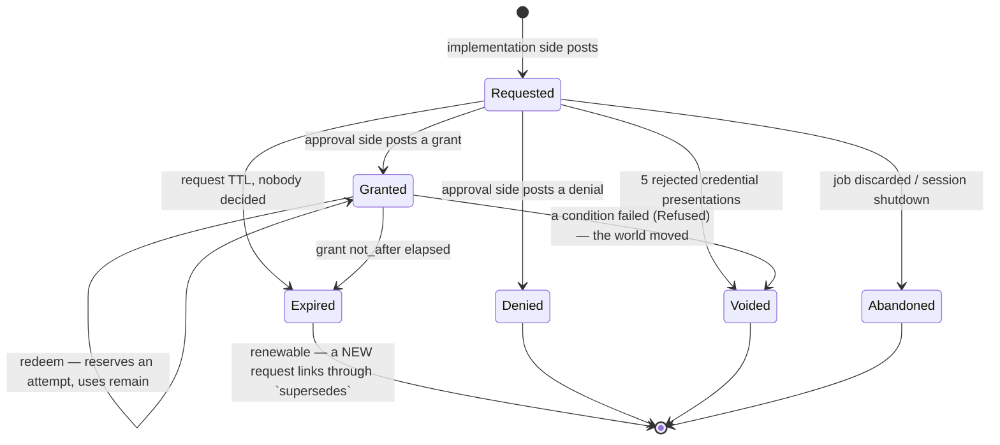
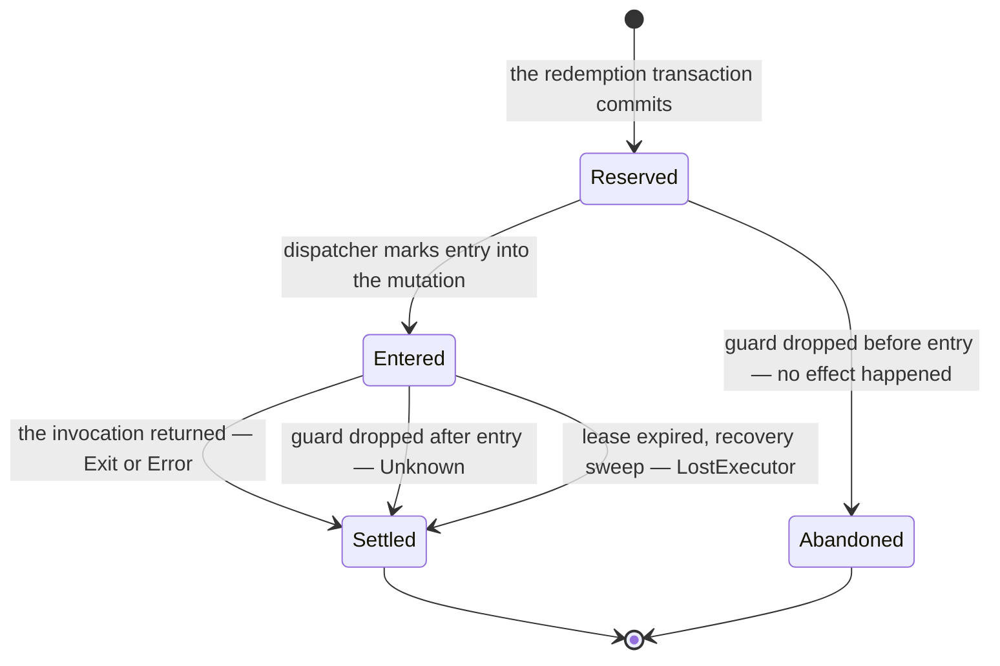

# The kaish approval ledger

**Status:** design, revision 2. The cross-model review's adopted revisions are folded into the body; this is the version a kernel PR starts from.
**Target:** kaish kernel 0.13 · **Drafted:** 2026-08-01 · **Revised:** 2026-08-01
**Inputs:** [safety-inventory-2026-08.md](safety-inventory-2026-08.md) (problem statement), [../git.md](../git.md) §7 and [architecture.md](architecture.md) §G.3 (first consumer), kaish `main` @ `818ff48`
**Supersedes:** the confirmation latch as a standalone mechanism (see §E)

## Provenance

Revision 1 was reviewed by two frontier models against the real kaish tree
(kaibo batch, max thinking). Both reviews are kept verbatim in
[reviews/](reviews/): [gemini-pro](reviews/ledger-review-gemini-2026-08.md)
("ship it, fix four blockers") and
[gpt-sol](reviews/ledger-review-gpt-2026-08.md) ("do not merge the public types
yet", six blockers). The reviews' `approval-ledger.md:NNN` citations resolve
against revision 1's body — `git show 1b36591:docs/design/approval-ledger.md` —
which the layered draft merged at `80abfda` carried unedited, 210 lines below
its review-synthesis header.

That header is gone. Everything it adopted is in the body below, written as if
designed that way; everything it superseded is deleted rather than kept
alongside. The fold was done on 2026-08-01. What the reviewers raised and this
design did **not** take is recorded in §I.4, and the questions that are still
genuinely open are in §I — they are marked open, not quietly closed.

The design direction survived the review intact. What changed is rigor:
attempts are first-class, there is one linearization rule, settlement is
drop-safe, the public request view is tokenless by construction, replay is
internally correlated, and the migration goes through a compatibility adapter
instead of a rename-then-behavior split.

---

## 0. The one-paragraph version

Every privileged operation in kaish posts a **request** to an append-only
ledger and blocks until a matching **grant** exists. The implementation side
has exactly one call — `ctx.request_approval(draft)` — and never learns whether
the grant came from a human at a terminal, a standing policy rule, or an
embedder's hook. The approval side is the only side that can grant, and it does
so by posting its own entry. Executing consumes a reserved **attempt**, and
every attempt has exactly one terminal entry. Nothing is cryptographic: the
ledger buys *correctness under concurrency, a readable record afterward, and a
state machine whose illegal transitions are loud*, not tamper-evidence. Every
ledger append is also a tracing event at the same call site, so the audit story
and the OTel story are one story.

The existing latch becomes the first consumer: one operation class (`fs.*`),
one policy ("ask the human"), the same `--confirm=<credential>` UX, the same
exit code 2.

### Naming

It is the **approval ledger**. Revision 1 called it a "double-entry"
facility and both reviewers rejected the label independently: there is no
trial-balance invariant and both handles wrap the same `Arc`. The property that
was ever load-bearing is **split authority** — the two sides post different
entries and neither can post the other's — and that property is kept, named
directly, and enforced by types (§A.1). Amy calls it the *permission ledger* in
conversation; the code, the docs, and the operation vocabulary say *approval*,
one term, one meaning.

### Verification notes against the tree

Claims from the safety inventory re-verified at `818ff48`:

- `NonceStore` uses `kaish_types::clock::Instant` for TTL (monotonic) but records no wall-clock time at all, so there is nothing to audit *with* even if we added a sink.
- The dispatch-seam capture (`crates/kaish-kernel/src/kernel.rs:3322`) is unconditional and documented as such — good, because the ledger needs the invocation on every request that a human might later confirm.
- The seam's post-execution code runs only on normal return (`kernel.rs:3324-3340`), and `ToolCtx`'s cancellation is cooperative with no dropped-future callback (`crates/kaish-tool-api/src/ctx.rs:82-101`). This is why settlement is a guard and not after-return code (§C.2).
- Invocation capture is best-effort today: `tool_args.to_argv().unwrap_or_default()` silently substitutes an empty argv (`kernel.rs:3310-3321`). The ledger must label that state rather than inherit it (§A.3).
- `async_trait` is already a dependency of `kaish-tool-api` and `Tool` already uses it (`crates/kaish-tool-api/src/tool.rs:19`). `ToolCtx` does not, but adding `#[async_trait]` with **defaulted** async methods is not a breaking change for existing implementors.
- `wait`'s single-latch behavior is at `crates/kaish-kernel/src/tools/builtin/wait.rs:138-140` (`latch.get_or_insert`), with the "first latch wins" comment intact.
- `Scope` has no readonly/pin concept of any kind (`crates/kaish-kernel/src/interpreter/scope.rs:602-608`) — `set +o latch` is a plain setter. Confirmed.
- `generate_nonce`'s non-CSPRNG folding to `u32` is **fixed and in flight**: [kaish#259](https://github.com/tobert/kaish/pull/259) draws 16 bytes from `getrandom` and renders 32 lowercase hex. That PR deliberately deferred the rejected-attempt counter because a wrong guess could not be attributed to an issued nonce; §A.6 is where that lands.

---

## A. The data model

### A.1 Split authority — the property, and how types enforce it

The ledger is one append-only log with **three posting authorities**. An entry
names which authority wrote it, and no authority can write another's entry.

| Authority | Held by | Entries it may post |
|---|---|---|
| **Requester** | the implementation side — kernel gate sites, plugins through `ToolCtx` | `Requested`, `Redeemed`, `Settled` |
| **Approver** | the approval side — a human at the REPL, an `Approver` hook, a standing rule, the embedder | `Granted`, `Denied`, `StandingIssued`, `StandingRevoked` |
| **The ledger itself** | `LedgerInner`, on observation or sweep | `Expired`, `Refused`, `Voided`, `Abandoned`, `TokenRejected` |

Three handles, and the separation is a type error to violate:

```rust
/// The implementation side's handle. Obtained from ExecContext / ToolCtx.
/// Posts obligations and reads tokenless views. CANNOT grant.
#[derive(Clone)]
pub struct Requester(Arc<LedgerInner>);

/// The read side. Tokenless projections for `approvals list`, /v/approvals,
/// `wait`, and embedder introspection. Posts nothing.
#[derive(Clone)]
pub struct Approvals(Arc<LedgerInner>);

/// The approval capability. Not constructible outside the kernel construction
/// seam: no public constructor, no `Default`, no `Deserialize`, no `Clone`
/// from a `&Kernel`. An agent session does not possess one.
pub struct ApproverHandle(/* private */);
```

A tool holding a `&mut dyn ToolCtx` can reach a `Requester` and an `Approvals`,
and there is no method on either that produces an `ApproverHandle` — which is
the whole security model, because "the agent turns off its own gate" is the
failure mode we are defending against. §D.3 states what that model does and
does not claim.

**The balance rule**, stated once:

> An operation may execute **iff** the ledger has committed a `Redeemed{attempt}`
> for it — why: redemption is the only transaction that checks the grant, and
> reserving the use *inside* that transaction is what makes two concurrent
> redemptions of a one-use grant impossible.
>
> Redemption commits only when, in one transaction: a `Requested(r)` exists; a
> `Granted(g)` with `g.request == r.id` exists and is neither expired, voided,
> nor superseded; `reserved_uses(g) < g.max_redemptions`; and the observations
> supplied with the transaction match `g.conditions` and were taken against the
> grant version the transaction commits against (§B.1).
>
> The books balance when: every `Granted` has exactly one `Requested` ancestor;
> every `Redeemed{attempt}` has exactly one live `Granted` ancestor; and every
> `Redeemed{attempt}` has exactly one terminal successor **keyed on the same
> `AttemptId`**. An unbalanced pair is a kernel bug — `debug_assert!` in debug,
> `LedgerError::InvariantViolated` in release, and **never** "proceed".

The `AttemptId` in that last clause is what makes the rule checkable. Keyed on
`RequestId` alone, two redemptions followed by one settlement is unbalanceable:
you cannot tell which attempt settled, whether one is still outstanding, or
whether a later settlement is a duplicate.

An unmatched *obligation* means the operation must not run. An unmatched
*authorization* is fine — it expires unused, and that shows in the record,
which is itself useful signal ("policy grants nobody redeems").

### A.2 Identity, credential, and the tokenless view

Today's nonce is simultaneously the operation's identity, its secret, and its
entire record. That is why the record evaporates: you cannot keep an audit
trail keyed on a bearer secret without leaking it, so the only safe thing to do
with a nonce is forget it.

Split them three ways:

```rust
/// Public, stable, safe to log, safe to print, safe to keep forever.
/// Format: "{ledger_epoch:8hex}-{seq}", e.g. "9c1a4f2e-42". Short form
/// ("42") accepted by CLI surfaces when unambiguous within the session.
pub struct RequestId(String);

/// One execution attempt against one grant.
/// Format: "{request_id}#{n}" where n is the reservation ordinal — a reader
/// can recover the request from an attempt id without a join, which matters
/// because the audit reader is often a human with one grep.
pub struct AttemptId(String);

/// The bearer credential presented as `--confirm=<credential>`.
/// 16 bytes from `getrandom`, 32 lowercase hex (kaish#259's format, kept).
pub struct RedemptionCredential(String);
```

**The credential never appears in a ledger entry** — why: an entry is
serialized to the sink, projected into `/v/approvals`, and cloned through
`ExecResult`, so any field that can hold a credential eventually leaks one. The
ledger stores the credential's hash in a side index (`hash -> RequestId`) inside
`LedgerInner`, and drops the index row when the request reaches a terminal
state. Nothing to redact, because nothing to redact is stored.

Three request types follow from that, and they are distinct types on purpose:

| Type | Crate | Who builds it | Carries |
|---|---|---|---|
| `ApprovalDraft` | `kaish-types` | the gate site, through a builder | operation, risk, resources, reason, hint |
| `ApprovalRecord` | `kaish-kernel` | the kernel, by stamping a draft | the draft plus id, principal, capture, trace context, timestamps, ttl |
| `ApprovalRequestView` | `kaish-types` | the ledger, by projecting a record | everything an outside reader may see — and **no credential field exists on the type** |

A draft must not deserialize as, or be accepted as, a stamped record — why:
otherwise a plugin forges a principal by handing back a value it constructed.
Stamping proves the provenance of the metadata, not the truth of the
plugin-supplied resource description; resource-specific code still has to
canonicalize and validate paths, refs, and repository identity before the
description means anything.

### A.3 The draft, the record, and the view

```rust
/// What a gate site builds. No identity, no principal, no invocation:
/// those are the kernel's to stamp.
#[non_exhaustive]
pub struct ApprovalDraft {
    pub operation: OperationId,      // "fs.remove", "trash.empty", "git.push"
    pub risk: RiskClass,             // Reversible | Recoverable | Irreversible
    pub resources: Vec<Resource>,
    pub reason: String,              // why the gate fired
    pub hint: String,                // display-only re-run string
}

/// The kernel's stamped record. Kernel-internal; the ledger projects it.
pub struct ApprovalRecord {
    pub id: RequestId,
    pub draft: ApprovalDraft,
    pub principal: Principal,        // who is asking
    pub capture: CaptureStatus,      // replayability, stated not implied
    /// W3C context captured at request time — this is what lets an approval
    /// granted 40 minutes later still nest under the originating trace.
    pub context: RequestContext,     // { traceparent, tracestate, baggage }
    pub job_id: Option<u64>,
    pub requested_at: SystemTime,
    pub ttl: Duration,
    /// Set when this request renews an expired predecessor (§B.6).
    pub supersedes: Option<RequestId>,
}

/// The public projection. Serialized into `ExecResult.approval`, `--json`,
/// `/v/approvals`, and `JobInfo`. There is no credential field.
#[non_exhaustive]
#[derive(Clone, serde::Serialize, serde::Deserialize)]
pub struct ApprovalRequestView {
    pub id: RequestId,
    pub operation: OperationId,
    pub risk: RiskClass,
    pub resources: Vec<Resource>,
    pub principal: Principal,
    pub capture: CaptureStatus,
    pub job_id: Option<u64>,
    pub reason: String,
    pub hint: String,
    pub requested_at: SystemTime,
    pub ttl: Duration,
    pub supersedes: Option<RequestId>,
}
```

**Capture status is an enum, not an `Option`** — why: the seam substitutes an
empty argv on failure today (`kernel.rs:3310-3321`), so an absent invocation and
a *failed* capture are indistinguishable, and replaying the second one replays
the wrong command.

```rust
#[non_exhaustive]
pub enum CaptureStatus {
    /// The seam captured the exact argv. The only replayable state.
    Exact(Invocation),               // { tool: String, argv: Vec<String> }
    /// The seam ran and there was no argv to capture.
    Unavailable,
    /// `to_argv()` failed. Loud in the record, never replayed.
    CaptureFailed(String),
    /// `tool.execute` was called directly — a unit test, or an embedder
    /// driving a tool outside the dispatcher.
    DirectExecution,
}
```

`Kernel::confirm` accepts only `Exact` — why: replaying a request whose argv is
empty or wrong performs a *different* operation than the one the approver saw.
Any other state must be granted through the approver capability and re-run by
the caller.

**Resource identity that is more than a path.** This is the piece the latch
structurally cannot express and git needs:

```rust
#[non_exhaustive]
pub struct Resource {
    /// Namespace of the identifier. In-tree: "path". Plugin-registered:
    /// "git.ref", "git.remote", "git.worktree", "url", "job".
    pub kind: String,
    /// Identifier within that namespace. "/home/a/x.txt", "refs/heads/main",
    /// "origin". Canonicalized by the producer before it is posted.
    pub id: String,
    /// The state-transition claim being authorized, when there is one.
    /// This generalizes `cas_overwrite`'s snapshot-compare.
    pub transition: Option<Transition>,
}

pub struct Transition { pub from: StateClaim, pub to: StateClaim }

#[non_exhaustive]
pub enum StateClaim {
    /// The resource does not exist (pre: creating; post: deleting).
    Absent,
    /// An opaque identifier the producer re-derives at redemption:
    /// a git oid, an etag, a generation number.
    Exact(String),
    /// A content digest. `cas_overwrite`'s prior bytes become a digest here —
    /// the ledger records the *claim*, the gate still holds the bytes.
    Digest { alg: String, hex: String },
    /// "I claim nothing about this side." Legal, and recorded, so an auditor
    /// can see which approvals were unconditioned.
    Unspecified,
}
```

`git push` becomes: `Resource { kind: "git.ref", id: "refs/heads/main",
transition: Some(Transition { from: Exact("a1b2…"), to: Exact("c3d4…") }) }`
plus `Resource { kind: "git.remote", id: "origin", transition: None }`. A policy
can then say "auto-approve `git.commit` where every `git.ref` matches
`refs/heads/agent/*`" without string-matching a display label or re-parsing
argv — which is exactly what an embedder is forced to do today.

**Principal**, the missing "who":

```rust
pub struct Principal { pub id: String, pub kind: PrincipalKind }
#[non_exhaustive]
pub enum PrincipalKind { Agent, Human, Automation, Unknown }
```

Seeded by `KernelConfig::with_principal`, defaulting to `Unknown`. It appears on
both the request (who asked) and the grant (who decided). A grant where
`decided_by == requested_by` and `kind == Agent` is the self-approval case,
which §D.3 refuses structurally and which the record shows if an embedder ever
configures its way into it.

### A.4 The authorization entry

```rust
#[non_exhaustive]
pub struct Grant {
    pub request: RequestId,
    pub decided_by: Principal,
    pub grounds: Grounds,
    pub not_after: SystemTime,
    /// `Some(1)` is the default for `RiskClass::Irreversible`. `None` means
    /// unlimited within `not_after` — today's reusable-nonce ergonomics,
    /// kept for the retry-idempotency case that motivated it.
    pub max_redemptions: Option<u32>,
    /// Preconditions re-verified at redemption. Defaults to exactly the
    /// transitions declared on the request's resources. An approver may
    /// **narrow** and may never **widen** — enforced at post time, loud.
    pub conditions: Vec<Condition>,
    pub decided_at: SystemTime,
    /// Bumped by any transaction that changes the grant. A redemption commits
    /// against the version it observed (§B.1).
    pub version: u64,
}

#[non_exhaustive]
pub enum Grounds {
    /// A human said yes. `channel` distinguishes the REPL terminal from an
    /// embedder's out-of-band UI.
    Human { channel: String },
    /// The embedder's synchronous policy hook.
    Policy { rule: String },
    /// A standing grant already in the ledger fired.
    Standing { grant: StandingId },
    /// An `observe` subscription matched (§C.6). Records the operation; never
    /// defers, never blocks, never prompts.
    Observe { subscription: SubscriptionId },
    /// The embedder granted directly through its `ApproverHandle`.
    Embedder,
}
```

The grant carries no credential and no `GrantId` — why no credential: §A.2. Why
no id: §B.3 forbids a second decision on a request (`AlreadyDecided`), so a
grant is uniquely identified by its request, and a second identifier is a second
thing to keep consistent. gpt's required model listed `grant: GrantId` on
`Redeemed`; if we ever allow re-granting a voided request, that id becomes
necessary and this is the line to revisit.

The `Standing` and `Observe` variants are the load-bearing ones for "the
approval side can automate some". A standing grant is *itself a ledger entry*
(`StandingIssued`), and every request it auto-approves produces a normal
`Granted` entry naming it. There is no path by which an operation runs without a
`Granted` entry, whether a human typed `y` or a rule fired at 3 a.m. — one shape
of record regardless of provenance is what makes the ledger worth reading.

### A.5 The attempt

An attempt is one execution against one grant. It is a first-class object with
its own lifecycle because a grant with `max_redemptions > 1` produces several,
and they can be outstanding at the same time.

```rust
/// Reserved by the redemption transaction, before any effect happens.
pub struct Attempt {
    pub id: AttemptId,
    pub request: RequestId,
    pub principal: Principal,     // who redeemed, which may differ from who asked
    pub reserved_at: SystemTime,
    /// The attempt is live until this deadline. On expiry with no terminal
    /// entry, the recovery sweep settles it `LostExecutor` (§C.2).
    pub lease_until: Instant,
    pub entered: bool,            // set by the dispatcher immediately before the mutation
}
```

Two handles, and the split is what makes settlement drop-safe:

```rust
/// Handed to the tool. Identifies the attempt; has no Drop behavior; cannot
/// settle. A tool that forgets it changes nothing.
#[derive(Clone, Copy)]
pub struct AttemptHandle<'a>(&'a AttemptId);

/// Held by the dispatcher for the life of the invocation. Its Drop settles.
#[must_use]
pub struct AttemptGuard { /* attempt id + synchronous outbox handle */ }
```

**Tools receive the handle, the dispatcher owns the guard** — why: the tool
cannot be trusted to run code on its own cancellation, and the dispatcher frame
is dropped by every path that ends an invocation, including unwind.

### A.6 The entry log

```rust
#[non_exhaustive]
#[derive(serde::Serialize, serde::Deserialize)]
#[serde(tag = "entry", rename_all = "snake_case")]
pub enum LedgerEntry {
    Requested   { seq: u64, at: SystemTime, request: ApprovalRequestView },
    Granted     { seq: u64, at: SystemTime, grant: Grant },
    Denied      { seq: u64, at: SystemTime, request: RequestId, by: Principal, reason: String },
    Expired     { seq: u64, at: SystemTime, request: RequestId, what: Expiring },
    Redeemed    { seq: u64, at: SystemTime, request: RequestId, attempt: AttemptId },
    /// Preconditions no longer hold. Voids the grant. This is `cas_overwrite`'s
    /// "file changed since the gate checked it", generalized.
    Refused     { seq: u64, at: SystemTime, request: RequestId, condition: Condition, found: StateClaim },
    Settled     { seq: u64, at: SystemTime, attempt: AttemptId, outcome: Outcome },
    /// The attempt or request ended with no effect. `attempt` is `None` when
    /// the request was discarded before any use was reserved.
    Abandoned   { seq: u64, at: SystemTime, request: RequestId, attempt: Option<AttemptId>, reason: String },
    Voided      { seq: u64, at: SystemTime, request: RequestId, reason: String },
    StandingIssued  { seq: u64, at: SystemTime, grant: StandingGrant },
    StandingRevoked { seq: u64, at: SystemTime, id: StandingId, by: Principal, reason: String },
    /// A credential was presented and did not authorize. Carries the running
    /// count against its target; five in a window voids the request (§E.5).
    TokenRejected   { seq: u64, at: SystemTime, target: RejectionTarget, attempts: u32 },
}

#[non_exhaustive]
pub enum Outcome {
    /// The invocation returned. This is the common case.
    Exit(i64),
    /// The tool reported a richer failure than an exit code.
    Error(String),
    /// The attempt was interrupted after entering the mutation. Whether an
    /// effect happened is not known.
    Unknown { reason: String },
    /// The executor is gone — dropped future, aborted task, panic, or process
    /// death found by the recovery sweep. Whether an effect happened is not known.
    LostExecutor,
}

/// A rejected credential must be attributable, or the counter has nowhere to
/// attach — this is the model kaish#259 deferred its rate limit for.
#[non_exhaustive]
pub enum RejectionTarget {
    /// The credential hashed to a live request. The count is that request's.
    Request(RequestId),
    /// The credential resolved to nothing. The count is the session's, so a
    /// guessing loop is still rate-limited and still visible.
    Session { principal: Principal },
}
```

**`Abandoned` never implies "no effect happened" unless the ledger can prove
it** — why: a cancelled tool may already have written, and an audit record that
says "abandoned" when a file was deleted is worse than no record. The rule:

| Situation | Terminal entry | Why |
|---|---|---|
| The guard drops before the dispatcher marked `entered` | `Abandoned{attempt}` | The mutation was never called, so "no effect" is a fact, not a guess. |
| The guard drops after `entered` | `Settled{Unknown}` | The tool was inside the mutation; the effect status is unknown and the record says so. |
| The lease expires with no terminal entry | `Settled{LostExecutor}` | The process died. Same honesty, different discovery path. |
| The request is discarded before any reservation | `Abandoned{attempt: None}` | Request-level, not attempt-level. |

`seq` is monotonic per ledger. `at` is wall-clock, from
`kaish_types::clock::system_now`, and exists purely for the record — **all
expiry math uses `clock::Instant`**, so a wall-clock jump can neither extend nor
void a live grant. This is a genuine hazard for a system that holds approvals
for minutes to hours across a laptop suspend; the doc comment says so, so nobody
"simplifies" it later.

Serde is stable and internally tagged, so an NDJSON sink is the obvious durable
form (§D.5).

**Not cryptographic, stated in the type's own docs:** no signatures, no hash
chain, no monotonic-counter attestation. Anything running in-process can call
the Rust API directly and skip the log. The ledger defends against *accident,
drift, forgetfulness, and a confused agent*, and it produces a record you can
read afterward. It does not defend against a hostile in-process actor, and
pretending otherwise would be the worst thing we could ship.

### A.7 Anti-drift for the operation taxonomy

Follow `classify_command`'s template (`docs/devlog.md:1568-1585`): in-tree
operations come from a closed enum, and the mapping from enum to dotted string
is an exhaustive match, so **adding a gate site without registering its
operation is a compile error**.

```rust
pub enum KernelOperation { FsRemove, FsOverwrite, FsRename, TrashEmpty }
impl KernelOperation { pub const fn id(self) -> &'static str { /* exhaustive match */ } }
```

Plugins get `OperationId::namespaced(prefix, rest)`, where the prefix is
registered once at tool-registration time. A plugin that posts `fs.remove` gets
a loud rejection — the `fs.` and `trash.` namespaces belong to the kernel. This
is cheap and it keeps a policy engine's vocabulary honest.

---

## B. The state machine

### B.1 The linearization contract

This is the rule the rest of §B is derived from, and it is stated before the
diagrams because the diagrams are consequences of it.

> **An operation wins by the order in which its conditional ledger transaction
> commits.** A redemption committed before an expiry, a revocation, or a
> competing redemption remains authorized; one committed afterward fails. Every
> derived event has a uniqueness key and is idempotent: a duplicate expiry,
> voiding, abandonment, or settlement is rejected or absorbed, never appended
> twice.

Uniqueness keys, so "idempotent" is checkable rather than aspirational:

| Derived event | Uniqueness key |
|---|---|
| `Expired{what: Request}` | `(request_id, "request")` |
| `Expired{what: Grant}` | `(request_id, "grant")` |
| `Voided` | `(request_id, cause)` |
| `Settled` | `(attempt_id)` |
| `Abandoned` | `(request_id, attempt_id)` — `attempt_id` absent is its own key |
| `Refused` | `(request_id, condition)` |

**Standing-grant consumption is part of the same critical section** — why:
matching a rule, checking that it is not revoked, consuming one of its
`max_uses`, and appending the derived `Granted` must be one transaction, or two
concurrent requests both consume the last use.

**Nothing external runs inside the transaction.** No resolver, embedder hook,
human prompt, telemetry export, or `.await` happens while the ledger lock is
held. The pattern for anything that needs the outside world is:

1. snapshot the request and the grant `version` under the lock;
2. release the lock;
3. run the external stage — observe conditions, call `Approver::decide`;
4. commit conditionally against the same `version`;
5. reject and retry if the version moved.

A stale result must never overwrite a concurrent grant, void, expiry, or
denial — why: the stale result was computed against a world the ledger has
since left, and "not matched" arriving after "granted" would silently un-grant.

**Clock and durability scope, v1:** one process, one `Arc<LedgerInner>`, one
monotonic clock domain, **no durability claim**. Several kernels in one process
may share a ledger; separate processes may not. `SystemTime` on entries is
record-only. A durable or cross-process ledger needs absolute expiry with
defined wall-clock-rollback behavior, or a persisted lease/epoch mechanism —
neither is in v1, and the doc comment on `LedgerConfig` says so.

### B.2 States

Two lifecycles, because a request and an attempt are different objects. Revision
1 had a single `Redeeming` request state; it is deleted — a request with two
outstanding attempts has no single "redeeming" state to be in.

**Request lifecycle**, keyed by `RequestId`:



**Attempt lifecycle**, keyed by `AttemptId`:



A request is done when it is terminal **and** every attempt it reserved is
terminal. `GateState` reports both, so a reader never has to infer it:

```rust
pub struct GateState {
    pub phase: Phase,           // Requested | Granted | Denied | Expired | Voided | Abandoned
    pub open_attempts: u32,
    pub uses_remaining: Option<u32>,
}
```

### B.3 The transition table (this is the test matrix)

| From | Event | To | Entry appended | If illegal |
|---|---|---|---|---|
| — | `post_request` | `Requested` | `Requested` | — |
| `Requested` | `grant` | `Granted` | `Granted` | — |
| `Requested` | `deny` | `Denied` | `Denied` | — |
| `Requested` | TTL elapsed, observed | `Expired` | `Expired{what: Request}` | — |
| `Requested` | `redeem` | ✗ | `TokenRejected` | `LedgerError::NotAuthorized` — exit 1, loud |
| `Granted` | `redeem`, conditions hold, uses remain | `Granted` + a new `Reserved` attempt | `Redeemed{attempt}` | — |
| `Granted` | `redeem`, a condition fails | `Voided` | `Refused` + `Voided` | the operation must re-request |
| `Granted` | `redeem`, uses exhausted | `Granted` | `TokenRejected` | `LedgerError::Exhausted` — exit 1, loud |
| `Granted` | `redeem`, observed version is stale | `Granted` | none | `LedgerError::Conflict` — the caller re-observes and retries |
| `Granted` | `not_after` elapsed | `Expired` | `Expired{what: Grant}` | — |
| `Granted` | `grant` again | ✗ | none | `LedgerError::AlreadyDecided` |
| `Reserved` | dispatcher marks entry | `Entered` | none | — |
| `Reserved` | guard dropped | `Abandoned` | `Abandoned{attempt}` | — |
| `Entered` | `settle(outcome)` | `Settled` | `Settled{attempt, outcome}` | — |
| `Entered` | guard dropped, unsettled | `Settled` | `Settled{attempt, Unknown}` | — |
| `Entered` | lease expired, recovery sweep | `Settled` | `Settled{attempt, LostExecutor}` | — |
| `Settled`/`Abandoned` | `settle` again | ✗ | none | absorbed idempotently by `AttemptId`, §B.1 |
| `Denied`/`Voided`/`Abandoned` | anything | ✗ | none | `LedgerError::Terminal` |
| `Expired` | `renew` | a new `Requested` | `Requested{supersedes}` | — |

**Illegal transitions are loud, not silent, and never permissive.** Every `✗`
row returns `Err(LedgerError)`, which the gate site converts to a failing
`ExecResult`; there is no code path in which a rejected transition results in
the operation proceeding. The distinction that decides whether a debug build
also panics: `NotAuthorized`, `Exhausted`, `Conflict`, and `Terminal` are
ordinary runtime outcomes; `InvariantViolated` — a `Settled` with no `Redeemed`
ancestor, a `seq` gap, a grant whose conditions widened its request — is a
kernel bug and `debug_assert!`s.

### B.4 Redemption is a reserve-a-use transaction

```rust
/// The single linearization point for authorization. Everything it checks and
/// everything it appends happens in one critical section.
fn redeem(
    &self,
    ctx: RedemptionContext,
    observed: &[(Condition, StateClaim)],
    observed_version: u64,
) -> Result<AttemptGuard, LedgerError>;
```

Atomically: establish the order against expiry, revocation, renewal, and other
redemptions; verify the observed grant version still matches; verify remaining
uses; reserve one use; append `Redeemed{attempt}`; return the guard. Condition
*observation* happens before the call and outside the lock (§B.1), which is why
the version is a parameter.

`RedemptionContext` is internal and is what makes replay coherent:

```rust
/// Kernel-internal. Never crosses the tool boundary, never serialized.
pub struct RedemptionContext {
    pub request_id: RequestId,
    /// Present when an authority already reserved the attempt — the
    /// `Kernel::confirm` path. Absent for a first-pass gate call.
    pub reserved: Option<AttemptId>,
}
```

**Replay redeems the original request; it does not post a new one** — why: a
bare replay re-hits the gate, and a gate that cannot tell "I am the approved
re-run of request 42" from "I am a fresh `rm`" posts a second request and the
human approves the same thing twice. The protocol:

1. The original record stores an immutable operation/resource description and a `CaptureStatus`.
2. An authority grants that request through its `ApproverHandle`.
3. `Kernel::confirm` reserves an attempt for the original request, atomically.
4. The replay is dispatched carrying a `RedemptionContext`, not a bearer string.
5. At the gate, the freshly built draft must match the granted operation and resources **exactly** before the reservation is accepted. A mismatch is loud and the reservation is released.
6. Any *different* gate reached later in the replay posts its own new request. One approval authorizes one operation.

### B.5 Redemption-time condition checks

Keep the latch's replay model — it is proven, it is what makes `Kernel::confirm`
a one-liner, and every gated operation already has to be idempotent-on-replay by
construction. Do **not** build suspend-and-resume; a tool that gets halfway
through and then asks is a tool that has already done half of something
unauthorized.

What generalizes is `cas_overwrite`. Today
(`crates/kaish-kernel/src/tools/context.rs:269-292`) the pattern is: snapshot
bytes at gate time, re-read at write time, loud `InvalidOperation` on mismatch,
and — critically — a re-read *failure* propagates rather than defaulting to
empty. That is precisely right. Lift it:

```rust
/// A resolver the producer registers for its resource kinds. The kernel ships
/// one for "path" (digest through the backend). kaish-git ships one for
/// "git.ref" (oid through gix). Called before redeem, outside the ledger lock.
#[async_trait]
pub trait StateResolver: Send + Sync {
    fn kind(&self) -> &str;
    /// The resource's current state. An I/O failure is `Err` and refuses the
    /// redemption — never `Ok(Unspecified)`, which would silently pass.
    async fn observe(&self, id: &str) -> Result<StateClaim, ResolverError>;
}
```

A mismatch appends `Refused{condition, found}`, voids the grant, and returns a
loud `ExecResult`.

**These checks detect stale authorization; they do not close the TOCTOU
window** — why: the resolver says the expected condition held at observation
time, and nothing stops another actor changing the resource between then and the
write. Closing the window is the *mutation's* job: the final write must be an
atomic conditional operation that carries the expected value — for git refs,
git's own compare-and-swap ref update; for files, the write-temp-then-rename
primitive `cas_overwrite` still lacks (§E.5). The ledger's contribution is that
the expected value is recorded, checked, and available to hand to that
primitive.

For git this is the whole story: approve `refs/heads/main: a1b2… → c3d4…`; if
`main` moved to `e5f6…` while the human was thinking, the push does not happen
and the record says exactly why.

### B.6 Expiry and renewal — the dead-nonce-forever fix

Today a `Latched` background job at T+61s is unfulfillable and
unkillable-without-discard. Under the ledger:

- Expiry **materializes** an `Expired` entry the first time it is observed — on any read of the request's state, or on the ledger's opportunistic sweep, the same place today's GC runs. It does not silently vanish; the record shows "nobody decided in 60s", which is a fact worth having. The entry's uniqueness key (§B.1) makes two observers racing to append it harmless.
- `Expired` is not terminal for the *thread of intent*. `ApproverHandle::renew(request_id)`, `approvals renew <id>`, and `Job::renew_gate()` post a **new** `Requested` carrying the original's operation, resources, capture, principal, and trace context, with `supersedes: Some(old_id)`. The chain is walkable, so "this took four attempts over two hours" is legible.
- Renewal re-observes the transitions before posting. If the world already moved, renewal fails loud rather than posting a request whose claims are already false.
- Renewal moves the job's request pointer. A job's stored result, status, confirmation lookup, and discard behavior all follow the new `RequestId` in one transaction — why: a job indexed by a dead request id is the dead-nonce bug wearing a new hat.
- `JobStatus::Latched` keeps its name and meaning ("held on an unsatisfied gate"). What changes is that a latched job's held request is a ledger reference, so renewal has somewhere to write.

**Renewal is not re-approval.** A renewed request starts at `Requested` and needs
a fresh decision. A standing grant will auto-approve it again; a human will be
asked again. That is correct: nothing about the passage of an hour makes a stale
approval better.

---

## C. The authorization handoff

### C.1 One call pattern on the implementation side

```rust
// The ONLY thing a gate site ever writes.
let attempt = ctx.request_approval(draft).await.into_result()?;
// ... perform the operation ...
```

`request_approval` returns an enum, not a `Result` — why: "denied", "pending",
"this context has no ledger", and "the ledger is unavailable" are four different
facts, and collapsing them into one `Err` loses the one the caller most needs to
report.

```rust
#[non_exhaustive]
pub enum ApprovalOutcome<'a> {
    /// A use is reserved. The dispatcher holds the matching guard.
    Authorized(AttemptHandle<'a>),
    /// No decision yet. Exit 2, the view rides the control plane.
    Pending(ApprovalRequestView),
    Denied(DenialReason),
    /// This context has no ledger — a unit-test harness, a minimal embedder.
    Unsupported,
    /// The ledger exists and could not answer: sink backpressure, capacity.
    LedgerUnavailable,
}
```

**Every non-`Authorized` arm fails closed.** `into_result()` is the ergonomic
shim that turns the enum into the `Err(ExecResult)` that gate sites already
return verbatim — exit 2 for `Pending`, exit 1 for `Denied`, `Unsupported`, and
`LedgerUnavailable`. It mirrors `gate_overwrites`'s existing `Err(result)`
contract (`context.rs:828`), which callers already know never to fall through.
The enum is the contract; the shim is convenience.

The tool cannot tell — and has no API to ask — whether the grant came from a
human, a policy hook, or a standing rule. `AttemptHandle` exposes its ids and
nothing about provenance.

### C.2 Settlement is a dispatcher-owned guard

**Tools never settle.** The dispatcher installs an `AttemptGuard` when a
redemption is reserved and holds it for the life of the invocation; the guard's
`Drop` is what makes settlement survive the paths that after-return code cannot
reach.

The paths that after-return code does not cover, verified in the tree: the
future is dropped, its task is aborted, execution panics, the process
terminates, a nested dispatch outlives the outer invocation, or the effect
happens and cancellation lands before the tool returns. `kernel.rs:3324-3340`
runs only on normal return, and `ctx.rs:82-101` is cooperative with no
dropped-future callback.

The protocol:

- **Normal return** — the seam settles explicitly with the invocation's exit code. One place, no forgetting. A tool wanting a richer outcome calls `ctx.settle_with(&handle, outcome)`, which records the outcome on the dispatcher's guard so the seam does not overwrite it.
- **Panic or drop** — `Drop` posts through a **synchronous outbox**: an in-memory queue the ledger drains, because `Drop` cannot reliably run async I/O. The outcome follows §A.6's table: `Abandoned` before `entered`, `Settled{Unknown}` after.
- **Process death** — nothing runs. The attempt's lease expires and the recovery sweep settles it `LostExecutor`. A late settlement arriving after the sweep is absorbed by the `AttemptId` uniqueness key rather than appended twice.
- **Settlement failure after a successful write** — the write cannot be rolled back, so the outbox retries and, if it cannot, the ledger records an audit gap explicitly. A missing settlement is reported, never inferred.

Background jobs use the same mechanism: the guard lives in the job's frame, so
discarding a job drops it, and `JobStatus::Latched` stops being derived from a
completed `ExecResult` and starts being backed by a live request. There is no
job-owned redemption guard today (`scheduler/job.rs:180-230`); this design adds
one.

### C.3 The decision chain

Four stages, tried in order, first non-`Defer` wins:

1. **Subscriptions and standing grants** — pure ledger lookup, no hook, no I/O, inside the transaction. This is the auto-approve fast path (§C.5, §C.6).
2. **`Approver::policy`** — synchronous, on the hot path, contractually non-blocking. Suitable for allowlists, risk-class rules, and "never `git.push.force`, full stop".
3. **`Approver::decide`** — async, may take minutes. Runs under a `ctx.patient(budget)` hold so a human's think time does not trip the script watchdog, and `select!`s against the cancellation token per `ToolCtx::patient`'s contract (`crates/kaish-tool-api/src/ctx.rs:92-94`). **Never called while holding the ledger lock**, and its result is committed conditionally against the version snapshot per §B.1.
4. **`Defer` all the way through** ⇒ exit 2, the request stays `Requested`, and fulfilment happens out of band. This is today's behavior, byte for byte, and it is what a non-interactive kernel with no `Approver` configured does.

```rust
#[async_trait]
pub trait Approver: Send + Sync {
    fn policy(&self, req: &ApprovalRequestView, ledger: &Approvals) -> Decision {
        let _ = (req, ledger);
        Decision::Defer
    }
    async fn decide(&self, req: &ApprovalRequestView) -> Decision {
        let _ = req;
        Decision::Defer
    }
}

#[non_exhaustive]
pub enum Decision {
    Grant(GrantTerms),
    Deny { reason: String },
    /// "Not my call." Falls through to the next stage. Never means "yes".
    Defer,
}
```

Both methods are defaulted, so an embedder implements only the half it cares
about, and `Defer` as the default for both means **the trait's default behavior
is today's behavior** — an empty impl changes nothing. A hook that errors or
times out is treated as a denial, not as `Defer` — why: `Defer` advances to the
next stage, and a broken hook advancing toward auto-approval is a fail-open.

Both methods take the **tokenless view**, not the record — an `Approver` is
embedder code and does not need the kernel's internals to decide.

### C.4 The human-in-terminal flow

The REPL installs `TerminalApprover`, which holds the session's
`ApproverHandle`. Its `decide`:

- Renders the request to **the terminal**, not to stdout — the agent's output stream must not be the approval affordance. Shows operation, risk class, principal, and every resource with its transition (`refs/heads/main: a1b2c3d → c3d4e5f`). Shows `hint` last and labelled *display only*.
- Reads `y` / `n` / `a` / `Ctrl-C`.
  - `y` → `Grant(GrantTerms::once_for(req))`
  - `n` / `Ctrl-C` → `Deny { reason: "declined at terminal" }`
  - `a` → posts a `StandingIssued` scoped to this operation and these resources' *patterns* for the rest of the session, then grants. The "always" affordance and the audit trail are the same object.
- Runs under `ctx.patient(Duration::from_secs(300))`.
- **Non-TTY REPL** (piped script, `kaish -c`) → `Defer`. Exit 2 and the existing contract. No prompt is ever written to a non-terminal.

**Embedders must segregate the prompt stream from the agent's stdout.** If a
PTY or logging configuration blends them, an agent can read the human's prompt.
That is an embedder-integration requirement, not a kernel mechanism — it becomes
a line in `EMBEDDING.md` and a note to kaibo and kaijutsu.

### C.5 Standing grants — automation that is auditable by construction

```rust
pub struct StandingGrant {
    pub id: StandingId,
    pub operations: Vec<OperationPattern>,     // "git.commit", "fs.*"
    pub resources: Vec<ResourcePattern>,       // { kind: "git.ref", pattern: "refs/heads/agent/*" }
    pub principal: Option<Principal>,          // None = any requester in this session
    pub max_uses: Option<u32>,
    pub expires_at: Option<SystemTime>,
    pub issued_by: Principal,
    pub reason: String,
}
```

Matching rules, chosen for loudness:

- **All-or-nothing.** Every resource on the request must be matched by some pattern in the standing grant. A request touching four refs where the rule covers three **Defers** — it does not auto-approve the three and gate the one, because partial authorization of a batch is exactly how you get a surprising outcome.
- **Kind must match exactly**; only `id` is globbed, through `kaish-glob`, so the semantics are the ones the rest of kaish already uses. A typed matcher is preferred where the kind has structure — git ref and repository identity in particular — and a broad textual glob over a typed resource is a smell the implementation should reject rather than accept.
- **Resources are matched as a set after canonicalization**, and one pattern may match several resources. Duplicate resources in a request are deduplicated before matching, so a request cannot dilute all-or-nothing by repeating a covered path.
- **Precedence among several matching rules:** the most recently issued rule that matches wins, and the `Granted` entry names it. One rule is credited, so the record answers "which rule let this through" with a single id.
- **Transitions are not matched, they are conditioned.** A standing grant does not care what the oids are; it copies the request's declared transitions into the resulting grant's `conditions`, so the redemption-time check still fires. "Auto-approve commits to `agent/*`" still fails loud if the ref moved.
- `max_uses` is consumed inside the same transaction that appends the derived `Granted` (§B.1). Exhaustion appends nothing special: the rule stops matching and the request Defers to the next stage. `StandingIssued` plus the count of `Granted{grounds: Standing{id}}` reconstructs the usage history.

Revocation (`ApproverHandle::revoke_standing`) appends `StandingRevoked` and
takes effect immediately for requests not yet granted. Already-issued grants are
unaffected — why: revoking a rule must not retroactively unauthorize an
operation that is mid-flight, which would leave a live attempt with a dead
grant, exactly the unbalanced state §A.1 forbids.

### C.6 `fs.*` observability — an opt-in, glob-scoped subscription

The question "does every `fs.*` operation post to the ledger when latch is off"
is answered: **it is configurable, and the default costs nothing.** The
`observe`/`enforce` split is the audit-versus-permission distinction, and it is
almost-free mechanism on top of standing grants.

**The dominant constraint: free when nothing is subscribed.** A `find`, `rm -rf`,
or `cp -r` over a large tree must not pay a per-path ledger cost unless an
operator asked for it. Every gate call site — `gate_overwrites` in
`tools/context.rs`, `rm`'s `decide_rm_action`, the trash paths — takes a cheap
early-out **before constructing a draft at all**: one relaxed atomic load
answering "are there any fs subscriptions?", almost always no, branch predicted,
done; and only then a glob match. Nothing is allocated on the unsubscribed path.
This is a hard requirement, not a nice-to-have — kaish's large-filesystem-job
performance is a first-class property and the ledger must not tax it by default.

**Two modes:**

- **`observe`** — matching operations post `Requested` + immediate `Granted{Observe}` and proceed; they never defer, never block, never prompt. This is "hook everything into an audit log" with no permission semantics. Mechanically it is a standing auto-grant with `Grounds::Observe` and unlimited uses, so it needs no new state-machine surface — the `Grounds` variant and the fast-path filter are the whole addition.
- **`enforce`** — matching operations go through the real decision chain. This is `set -o latch`, re-expressed as a subscription over `fs.*`.

**Scope is a glob over (operation class, resource path)** through `kaish-glob`:
subscribe `fs.write` and `fs.remove` under `/workspace/**` as `observe`, and
everything else — `/tmp/**`, reads, unmatched paths — stays unsubscribed and
free. kaibo's likely posture is to subscribe *nothing*; the capability exists as
proof that kaish **can** give a complete, typed, structured record of every
filesystem mutation an agent made, which is hard to get from a normal shell.

**Prior art worth mining at implementation time** (Amy's pointers):

- **ZFS / Solaris VSCAN** (the `vscan` dataset property plus `vscand`): the property being *off* means the hook is *not engaged* — zero cost, enforced by the property gate rather than a deep runtime branch. That is the free-when-unused requirement, and it says the "is anything subscribed" check belongs as high and as cheap as possible. VSCAN also carries a **scanstamp** xattr caching a content hash so an unchanged file skips re-scan, plus size and file-type exempt lists checked before the engine engages — the kaish analogs are a per-subscription size/kind exempt filter and, later, skipping a re-post for state already recorded unchanged.
- **Linux fanotify** is the closer analog: it has exactly this split — *notification* marks (stream events, non-blocking) versus `FAN_*_PERM` *permission* marks (block for a userspace verdict) — and the "you pay only where you place a mark" property. A subscription *is* kaish's mark; `observe` is a notification mark, `enforce` is a permission mark.

Subscriptions live on the approval side as a registry, consulted at the gate
before `request_approval` does any work. They are **additive and land after the
core migration**: the unsubscribed fast path is what the migration ships as the
default (§E.2), so nothing in §E depends on this section.

---

## D. API surfaces

### D.1 `ToolCtx` — plugins as first-class gate producers

This is the item [architecture.md](architecture.md) §G.3 calls the
prerequisite. Add to `kaish-tool-api`:

```rust
#[async_trait]                       // async-trait is already a dep of this crate
pub trait ToolCtx: Send + Sync {
    // ... existing methods unchanged ...

    /// Post an approval request and obtain authorization to proceed.
    ///
    /// Every non-`Authorized` outcome fails closed. `into_result()` converts
    /// to the `ExecResult` the tool must return **verbatim** — exit 2 when a
    /// decision is pending, exit 1 for a denial, a refusal, an exhausted
    /// grant, an unsupported context, or an unavailable ledger. Never fall
    /// through to the operation.
    ///
    /// Default impl returns `Unsupported`: a context with no ledger refuses
    /// rather than permits.
    async fn request_approval(&mut self, draft: ApprovalDraft) -> ApprovalOutcome<'_> {
        let _ = draft;
        ApprovalOutcome::Unsupported
    }

    /// Read-only, tokenless view for tools that surface pending approvals
    /// (`approvals`, `wait`, `jobs`). Default: an empty view.
    fn approvals(&self) -> Approvals { Approvals::empty() }

    /// Record a richer outcome than an exit code on the dispatcher's guard.
    /// Optional — the seam settles anything left over with the exit code.
    async fn settle_with(&mut self, attempt: AttemptHandle<'_>, outcome: Outcome) { /* … */ }
}
```

All three are **defaulted**, so this is additive: existing `ToolCtx`
implementors compile unchanged, and the `#[async_trait]` annotation does not
force them to change either because they override no async method.

It is still a behavioral migration, and the PR says so: existing test contexts
now refuse writes, direct tool tests need an explicit approving fixture, and
out-of-tree implementations compile but change behavior. `kaish-test-support`
ships an `ApprovingCtx` fixture so a test that wants the old behavior asks for
it in one line.

The builder produces a **draft**:

```rust
let draft = ApprovalDraft::builder("git.push")
    .risk(RiskClass::Irreversible)
    .resource(Resource::transition("git.ref", "refs/heads/main",
                                   StateClaim::Exact(old_oid), StateClaim::Exact(new_oid)))
    .resource(Resource::plain("git.remote", "origin"))
    .reason("pushing to a protected branch")
    .hint("git push --confirm=<credential> origin main")
    .build();
```

`request_approval` stamps `id`, `principal`, `capture`, `context`,
`requested_at`, and `ttl`. **A plugin cannot forge a principal or an
invocation** — why: the fields that matter for audit come from the kernel, not
the caller, and a plugin that could set them could describe itself as a human.

**With this, kaish-git needs only `kaish-tool-api`.** No `kaish-kernel`
dependency, no `as_any_mut` downcast. That is the acceptance criterion for PR 5.

### D.2 Embedder API

```rust
// KernelConfig — replaces with_nonce_store (see §E)
.with_ledger(Ledger)                        // share one ledger across kernels in one process
.with_ledger_sink(Arc<dyn LedgerSink>)      // durable
.with_approver(Arc<dyn Approver>)
.with_principal(Principal)
.with_latch_pinned(bool)                    // script cannot `set +o latch`
.with_state_resolver(Arc<dyn StateResolver>) // per resource kind
.with_subscription(Subscription)             // fs.* observe / enforce (§C.6)

// Kernel — read side only. There is no `Kernel::grant`.
fn approvals(&self) -> Approvals;
async fn confirm(&self, view: &ApprovalRequestView) -> Result<ExecResult>;

// ApproverHandle — the capability. Minted once, at construction.
impl ApproverHandle {
    async fn grant(&self, id: &RequestId, terms: GrantTerms) -> Result<()>;
    async fn deny(&self, id: &RequestId, reason: &str) -> Result<()>;
    async fn renew(&self, id: &RequestId) -> Result<ApprovalRequestView>;
    async fn grant_standing(&self, g: StandingGrant) -> Result<StandingId>;
    async fn revoke_standing(&self, id: &StandingId, reason: &str) -> Result<()>;
}

// Approvals (read side, tokenless)
fn pending(&self) -> Vec<ApprovalRequestView>;   // the primitive the inventory asks for
fn state(&self, id: &RequestId) -> Option<GateState>;
fn get(&self, id: &RequestId) -> Option<RequestChain>;  // request + decision + attempts
fn standing(&self) -> Vec<StandingGrant>;
fn log(&self, since: u64) -> Vec<LedgerEntry>;   // seq-cursored
```

**`with_approval_authority(bool)` is deleted.** A boolean on the same object
that also carries `grant` is not a type-level separation; the capability is. The
handle is minted at construction and returned to the embedder:

```rust
// Presets that do not approve return only a Kernel.
let k = Kernel::agent(config).await?;

// The preset that does hands the capability back, once.
let (k, approver) = Kernel::repl_with_authority(config).await?;
```

The exact constructor spelling is a bikeshed for implementation; the property is
not. **No `&Kernel`, no `&mut dyn ToolCtx`, and no `Approvals` may produce an
`ApproverHandle`** — why: if any of them can, the separation is a naming
convention.

`Kernel::confirm` keeps its name and its shape, documented as a façade over the
capability (§E.3 states what it may and may not do). One addition: the replay
executes with `req.context.traceparent` as the parent, so an out-of-band
approval nests under the trace that requested it.

### D.3 The security boundary

**What this protects against:** command-level agents and ordinary portable
tools. An agent driving kaish through commands, and a plugin written against
`kaish-tool-api`, cannot grant, cannot read a credential, and cannot turn the
gate off.

**What it does not protect against:** hostile loaded Rust, or a hostile
embedder. `ToolCtx::as_any_mut` lets a trusted in-tree tool recover the concrete
context (`crates/kaish-tool-api/src/ctx.rs:106-121`), and anything in-process can
call the Rust API directly. Both reviews agreed the honest claim is the narrow
one, and the type docs say the narrow one.

Structural properties, each of which is a test:

1. **No public value carries a credential.** `ApprovalRequestView` has no such field, `Grant` has none, and no `LedgerEntry` has one. The credential lives hashed in `LedgerInner`'s side index and nowhere else. This replaces revision 1's redaction-at-a-chokepoint rule, which was wrong on the facts: `Job::latch()` (`scheduler/job.rs:223-230`) only stamps a job id later, foreground results never pass through it, and the request is minted at `tools/context.rs:759-798` — so there was no universal chokepoint to redact at.
2. **Approval is a capability, not a flag** (§D.2).
3. **Tool-facing reads and approver reads are different types.** `Approvals` is tokenless by construction, so there is no token-bearing read to keep away from tools.
4. **Irreversible operations bind to the capability, not to a credential.** A `RiskClass::Irreversible` request redeems only when its grant was posted through an `ApproverHandle` and the redeeming session is the principal named on the grant. A human at the REPL keeps the `--confirm` UX because that session holds the capability; a credential visible to an agent never authorizes an irreversible operation. The muscle-memory cost of this is acknowledged and still open — §I.2.
5. **Action item, tracked as a PR gate: audit that no shell builtin bridges to the approval capability.** Enumerate every shell-reachable kernel method and prove none of them reaches `ApproverHandle`'s methods. `approvals grant` reaches the capability through `ExecContext`, which holds `Option<ApproverHandle>` and holds `None` in every agent preset; that is a runtime check for in-tree builtins and a structural one for everything outside the kernel crate. Say which is which — do not describe the runtime half as structural.

The self-approval case is refused by (2) and (4) together, and where an embedder
deliberately configures a session that is both requester and approver, the
record shows `decided_by == requested_by` with `kind == Agent` on every grant.

### D.4 Script and agent surface

**`--confirm=<credential>` and exit 2 are unchanged in spelling.** This is the
contract with the widest blast radius and the one 60+ tests prove; the flag does
not move. What changes is who can hold a credential: an agent session's exit-2
result carries a tokenless `ApprovalRequestView` and a hint that reads
`pending approval <request-id> — an operator must grant it`. The agent can see,
renew, and reason about its pending requests; it cannot redeem them.

New builtin, `approvals`, a subcommand tool (`ToolSchema.subcommands`, clap per
the house pattern):

| Command | Behavior |
|---|---|
| `approvals list [--pending\|--all\|--standing]` | Lists tokenless views as typed `OutputData`; `--json` through the kernel. |
| `approvals show <id>` | Prints the full chain — request, decision, every attempt, every settlement. |
| `approvals renew <id>` | Posts a superseding request; fails loud if the world already moved. |
| `approvals grant <id> [--once]` | Requires the approval capability; exit 1 naming the reason without it. |
| `approvals deny <id> [--reason R]` | Requires the approval capability. |
| `approvals revoke <standing-id>` | Requires the approval capability. |

**Multi-pending gates.** `ExecResult.approval` stays a single `Option<Box<…>>` —
one operation, one request; widening it to a `Vec` would push the multiplicity
into every consumer for a rare case. The pending set is a first-class queryable
primitive instead. `wait` on several gated jobs still surfaces the first request
(unchanged code shape at `wait.rs:138-140`) and its message becomes
``"3 approvals pending — run `approvals list`"``; `/v/approvals/pending`
enumerates all of them.

**VFS surface** (`/v/approvals`, precedent `/v/jobs/{id}/latch`):

```
/v/approvals/
├── pending                  # JSON array of pending ApprovalRequestView
├── standing                 # JSON array of live StandingGrant
├── log                      # NDJSON of the retained entries, seq-ordered
└── <request-id>/
    ├── request              # ApprovalRequestView as pretty JSON
    ├── state                # GateState: phase, open_attempts, uses_remaining
    ├── grant                # Grant JSON or empty
    └── attempts             # JSON array of Attempt + terminal outcome
```

**Read-only, enforced.** A write to anything under `/v/approvals` returns
`Unsupported`, loudly — why: granting through a file write would make "the agent
can write files" equivalent to "the agent can approve its own operations", which
is the hole this design closes. No projection can contain a credential, because
no stored value contains one.

`/v/jobs/{id}/latch` becomes `/v/jobs/{id}/approval`, same shape.

### D.5 Persistence, retention, and backpressure

**In-memory first, like `NonceStore`**, with a record shape designed for a sink
from day one.

```rust
pub struct LedgerConfig {
    /// Cap on LIVE entries only. Settled chains do not count against it.
    pub live_capacity: usize,          // default 4096
    /// Per-principal cap on live requests, so one session cannot exhaust the
    /// ledger for every other session.
    pub live_per_principal: usize,     // default 256
    pub request_ttl: Duration,         // default 60s — today's nonce TTL
    pub max_credential_attempts: u32,  // default 5
    /// Bounded queue to the sink. On full, the ledger fails closed.
    pub sink_queue_depth: usize,       // default 1024
}

pub trait LedgerSink: Send + Sync {
    /// Append. A sink error **fails the request closed** — an unrecorded
    /// privileged operation is exactly the corruption we refuse.
    fn post(&self, entry: &LedgerEntry) -> Result<(), LedgerSinkError>;
}
```

**Retention is partitioned** — why: a live chain and a settled chain have
different jobs. The live index holds anything not yet terminal and is never
evicted; a chain that reaches a terminal state streams to the sink and leaves
memory. Capacity therefore binds only on live entries, and the failure is loud:
`exit 2, "approval ledger at capacity (4096 live requests) — settle or abandon
pending approvals"`. Per-principal quotas and a live-entry gauge exist so that
"fail closed when full" is not a trivial denial of service.

**A memory-only v1 is an operational ledger, not a durable audit ledger.** Say
it in the type docs and in `EMBEDDING.md`. Evicting settled chains with no sink
configured means the ledger cannot answer "what did this agent delete last
Tuesday" — an embedder that wants that answer configures a sink.

**Sink backpressure is specified, not left to the implementation.** The sink is
driven by a bounded async channel of depth `sink_queue_depth`. When the channel
is full the kernel **fails closed** — new privileged operations stop — rather
than blocking the reactor or dropping audit records. A sink that cannot tolerate
its own unavailability buffers internally and returns `Ok`, accepting the
buffering risk explicitly; the kernel will not make that call silently, and
`EMBEDDING.md` carries that sentence.

**Recovery.** On construction with a sink that supports replay, the ledger reads
back the tail and settles every attempt with no terminal successor as
`Outcome::LostExecutor`. Without that sweep a durable ledger accumulates
permanently unbalanced chains and the invariant becomes unenforceable.

---

## E. Relationship to the existing latch

### E.1 The latch becomes a consumer

The mapping:

| Latch concept | Ledger concept |
|---|---|
| `NonceStore` | `Ledger` (record) plus the internal credential index |
| nonce (identity + secret + record in one) | `RequestId` (identity, public) + `RedemptionCredential` (secret, never stored in the clear) |
| `NonceScope { command, paths }` | `ApprovalDraft { operation, resources }` |
| subset-of-paths validation | resource-set match plus per-resource conditions |
| `set -o latch` | an `enforce` subscription over `fs.*` |
| `kaish-trash empty`'s unconditional gate | a rule that ignores subscription state and always enforces |
| `latch_result` | `ctx.request_approval` (a kernel-internal helper on top) |
| `gate_overwrites` | unchanged signature; reimplemented on `request_approval`, with `cas_overwrite`'s snapshot digest becoming a `Condition` |
| `Kernel::confirm` | same name, façade over the capability (§E.3) |

**Latch-off stays a fast path.** Revision 1 said gate sites post even with the
latch off; that is superseded. With the latch off and nothing subscribed, no
draft is constructed and no entry is posted — why: the unsubscribed fast path is
what keeps a `find` or an `rm -rf` over a large tree free (§C.6), and turning a
formerly free path into a per-file ledger append is a performance regression
disguised as an audit feature. An operator who wants the complete record
subscribes `observe`, and then gets `Requested` + `Granted{Observe}` +
`Redeemed` + `Settled` per batch — a glob of 10,000 files is **one** request with
10,000 resources, not 10,000 requests.

### E.2 The operation matrix

Write this before the migration and turn every row into a test — why: the rows
are where the migration can silently change behavior, and "silently" is the part
that matters.

Approval column values: `off` (latch off, nothing subscribed), `observe`,
`enforce` (`set -o latch` or an enforce subscription).

| Operation | Trash | Approval | Risk | Execution | Ledger events | Failure behavior |
|---|---|---|---|---|---|---|
| `fs.remove`, file ≤ `trash_max_size` | on | any | Reversible | any | None when `off`; `Requested`+`Granted{Observe}`+`Redeemed`+`Settled` when `observe`; same chain with a real decision when `enforce` | Trash failure is loud and never falls through to a permanent delete. |
| `fs.remove`, file > `trash_max_size` | on | off | Recoverable | any | None | Deletes permanently, as today. |
| `fs.remove`, file > `trash_max_size` | on | enforce | Recoverable | any | Full chain | Exit 2 pending; exit 1 on denial. Never deletes on either. |
| `fs.remove` | off | off | Recoverable | any | None | Deletes permanently, as today. |
| `fs.remove` | off | enforce | Recoverable | any | Full chain | As above. |
| `fs.overwrite`, existing file | on | any | Reversible | any | None when `off`; full chain otherwise | Prior bytes are **copied** to trash so the file keeps its identity for read-modify-write callers; a trash failure is loud. |
| `fs.overwrite`, existing file | off | enforce | Recoverable | any | Full chain, with the prior-bytes digest as a `Condition` | A changed file produces `Refused` + `Voided` and no write. |
| `fs.overwrite`, new file, or append | any | off / enforce | Reversible | any | None | Never gated — the operation destroys nothing (`context.rs:223-257`). An `observe` subscription that matches still posts. |
| `trash.empty` | any | any | Irreversible | any | Full chain, always | Gated unconditionally regardless of every flag (`kaish_trash.rs:168`). Requires the approval capability, not a credential (§D.3). |
| any gated operation | any | enforce | any | background | Full chain; the guard lives in the job frame | `JobStatus::Latched`; discard drops the guard and appends `Abandoned`. |
| any gated operation | any | enforce | any | pipeline stage | Full chain | A gate in a stage overrides a later stage's success, unchanged. |
| any gated operation | any | enforce | any | direct `tool.execute` | `capture: DirectExecution` | Not replayable by `Kernel::confirm`; a `ToolCtx` with no ledger returns `Unsupported` and exit 1. |
| any | any | off | any | any | None | **Ledger failure does not affect it.** A path that was never gated does not acquire a new failure mode from the ledger. |
| any gated operation | any | observe / enforce | any | any | — | Ledger or sink unavailable ⇒ fail closed, exit 1, naming the ledger. |

**The invariant that must not change:** trash failure is loud and never falls
through to an unprotected overwrite (`context.rs:916, 947-950`; test
`latch_trash_tests.rs:564`). Trash wins over the gate, because trash *is* the
safety net (`decide_mutation_action`, `context.rs:236-258`).

### E.3 The migration sequence

Both reviews independently killed revision 1's rename-then-behavior split.
`LatchRequest` is `#[serde(deny_unknown_fields)]` and serialized directly
(`crates/kaish-types/src/result.rs:72-74, :195-208`), so "byte-identical modulo
the key" holds only for a temporary compatibility projection, never for the
final tokenless type. The sequence:

| Step | What | Externally visible? |
|---|---|---|
| 1 | Formalize the ledger transactions and model-test the concurrency (§B.1). | No |
| 2 | Add the internal approval types **alongside** the latch types. | No |
| 3 | Build a latch **compatibility adapter backed by the ledger**, preserving today's TTL and reuse semantics exactly. | No |
| 4 | Port one gate, keeping the external `ExecResult.latch` shape. | No |
| 5 | Validate foreground, pipeline, background, VFS, trash, and CAS behavior against the §E.2 matrix. | No |
| 6 | Introduce the tokenless serialized API as an explicit wire break. | **Yes** |
| 7 | Remove the compatibility layer and delete `NonceStore`. | No |

The compatibility adapter is a temporary second representation, which the house
rule normally forbids. It earns its exception by being the thing that lets steps
4 and 5 prove the ledger against the existing suite before any consumer sees a
change — and step 7 deletes it in the same series, not "later".

The adapter's own contract is documented while it exists: who may call it, that
a reuse within TTL does **not** consume a use (matching `NonceStore::validate`,
`nonce.rs:119-155`), how it correlates a replay to the original request, what it
does when capture is not `Exact`, and whether a retry after a failed execution
is still allowed. A one-use, capability-bound grant is observably different from
a reusable nonce, and step 6 is where that difference becomes visible.

### E.4 What stays stable, what breaks

**Stable — does not move:**

- Exit code **2** means "authorization required".
- The `--confirm=<credential>` flag spelling and its per-builtin declaration.
- `Kernel::confirm(&view)` — same name, same job: replay the exact captured argv and retire the originating job on success.
- The control-plane discipline: never folded into `.data`, survives `clear_stdout`, survives the `ExecResult`↔`ToolResult` round trip, survives `--json`, overrides a later pipeline stage's success, rides `scatter`/`gather` rows.
- `JobStatus::Latched` — the name and the meaning, a held job distinct from `Failed`.
- `Job::latch()`-style single-chokepoint stamping of `job_id`.

**Breaking — one `**BREAKING:**` changelog bullet each, at step 6:**

| Was | Becomes |
|---|---|
| `ExecResult.latch: Option<Box<LatchRequest>>` | `ExecResult.approval: Option<Box<ApprovalRequestView>>` |
| `ExecResult::latch_request()` | `ExecResult::approval_request()` |
| `--json` envelope key `"latch"` | `"approval"` |
| `KernelConfig::with_nonce_store(NonceStore)` | `KernelConfig::with_ledger(Ledger)` |
| `KernelConfig::with_approval_authority(bool)` | removed — the capability replaces it (§D.2) |
| `kaish_kernel::nonce::{NonceStore, NonceScope}` | removed |
| `/v/jobs/{id}/latch` | `/v/jobs/{id}/approval` |
| `JobInfo.latch: Option<LatchRequest>` | `JobInfo.approval: Option<ApprovalRequestView>` |

Keeping `LatchRequest` permanently as a projection was considered and rejected:
it rejects unknown fields, so adding fields breaks old readers anyway, and a
lossy second representation of the same record is what the contributor
conventions forbid. Two embedders, one maintainer, pre-1.0 — take the break once
and cleanly.

**Credential width is not a break.** gemini flagged that widening the nonce could
break a consumer parsing it as an integer; kaish#259 checked the tree and found
exactly one place that assumed the old width, a unit test, now fixed. The
credential is an opaque string to every other consumer.

### E.5 The incidental hardening

**1. CSPRNG credentials — landed.** [kaish#259](https://github.com/tobert/kaish/pull/259)
replaces `RandomState + SystemTime → u32` with 16 bytes from `getrandom`
rendered as 32 lowercase hex, and makes an entropy failure a loud error rather
than a fallback. It is standalone and non-breaking because the value is opaque
to every consumer.

**The rate limit it deferred lands with the attempt model.** That PR could not
add a per-nonce rejected-attempt counter because a wrong guess did not identify
which issued nonce it was aimed at, so the counter had nowhere principled to
attach. `RejectionTarget` (§A.6) is that attachment point: a presentation whose
hash resolves to a live request counts against `RejectionTarget::Request`, and
one that resolves to nothing counts against `RejectionTarget::Session` so a
guessing loop is still bounded and still visible. `max_credential_attempts`
(default 5) rejected presentations against a request appends `TokenRejected`
entries and then `Voided`s it; a *correct* credential presented after the void
fails loud with "request voided after 5 invalid attempts", so the operator
learns something happened.

**2. Pinning the latch.** `set +o latch` from script code is the hole that makes
the whole thing advisory. Add `Scope.latch_pinned: bool`, seeded from
`KernelConfig::with_latch_pinned`, never settable from script, copied into forks
and pipeline stages exactly where `latch_enabled` already is
(`kernel.rs:5850-5857`). `set +o latch` under a pin returns **exit 1** with
`"latch: pinned by the embedder; cannot be disabled from script"` — loud, not a
silent no-op, because a silent no-op teaches an agent that its `set +o latch`
worked. The same pin generalizes to any script-reachable policy the ledger adds,
subscriptions included. Standalone and non-breaking.

**3. Single-use for irreversible operations.** `RiskClass::Irreversible` defaults
its grants to `max_redemptions: Some(1)`. `trash.empty`, `git.push --force`, and
`git.reset --hard` are `Irreversible`. `Reversible` and `Recoverable`
operations — `rm` under trash, gated overwrites — keep unlimited redemption
within the grant window, preserving the idempotent-retry ergonomics that
motivated the current design (`nonce.rs:124`, tests at `:209-217`). That
distinction is the whole point of having a risk class: idempotent retry is a
feature when the operation is undoable and a bug when it is not.

**4. Deferred to GitHub issues, not in this design's critical path:**

- `KAISH_LATCH` / `KAISH_TRASH` are read from `std::env` inside kernel presets (`kernel.rs:339, 455, 490, 518`). The frontend should read env and pass `KernelConfig`; the kernel presets should not touch `std::env`. The direction is safe today — env can only turn the gate on — but the hermeticity claim in `EMBEDDING.md:337-345` is inexact and should be fixed or footnoted.
- `--confirm` has no schema-level marker, so a policy engine cannot discover gateable operations from `tools --json`. Under the ledger the discoverable thing is the *operation taxonomy*: add `ToolSchema.operations: Vec<OperationId>` so `tools --json` advertises what a tool can request. This is the same vocabulary as architecture.md §C.4's effects markers, and they should be designed together.
- `cas_overwrite` is still not OS-atomic — no write-temp-then-rename primitive. §B.5 depends on that primitive for the *closing* half of TOCTOU, so this moves from "tracked" to "the named gap in the TOCTOU story".
- Resource canonicalization has no owner yet: path symlinks, encoding and case sensitivity, repository and worktree identity, ref normalization. Matching and conditions are only as good as the canonical form, and the resolver for each kind owns it.
- Captured argv and resource names can contain secrets. A durable sink inherits that; the retention and redaction policy for a sink is the embedder's, and `EMBEDDING.md` must say so rather than implying the ledger sanitizes.

---

## F. Spans and events

Follow `telemetry.rs`'s established shape: `#[instrument]` spans where the
duration is meaningful and the call site is off the hot recursion ring;
`tracing::` events where it is on it. The dispatch seam's breadcrumb-not-span
choice (`kernel.rs:3091`, GH #48 item 3) is respected — nothing here wraps
`execute_command_depth`'s future.

**Ledger appends and event emissions share one call site.**
`LedgerInner::append(entry)` emits the corresponding event; there is no second
place where a ledger fact can be recorded without a trace fact, or the reverse.
That is what makes "the OTel story and the audit story are the same story" true
rather than aspirational.

### Spans — short and linked, never long-lived

A span held open for a human's think time retains collector resources and
reports a misleading operation latency. Four short spans, linked by
`RequestId` and `AttemptId`:

| Span | Level | Where | Attributes | What it measures |
|---|---|---|---|---|
| `approval.request` | info | `ExecContext::request_approval` | `approval.request_id`, `approval.operation`, `approval.risk`, `approval.resource_count`, `approval.principal`, `job_id` | Request construction and the synchronous stages only. Closes at the decision or at `Defer` → exit 2. |
| `approval.decide` | info | around `Approver::decide` | `approval.stage`, `approval.decision`, `approval.grounds`, `approval.decided_by` | The approver's own duration, separated so policy latency and human latency are distinguishable. |
| `approval.attempt` | debug | redemption through settlement | `approval.request_id`, `approval.attempt_id`, `approval.conditions_checked`, `approval.precondition_ok`, `approval.outcome` | One execution. Records `err` on refusal. Debug because it is per-execution. |
| `approval.confirm` | info | `Kernel::confirm` | `approval.request_id`, `approval.tool` | The replay. `confirm` sits *outside* the `execute_argv` span it creates, so this correctly parents it. |

Request-to-decision latency is a **metric**, not a span — why: it is a duration
between two events that may be minutes apart in different traces, which is what
a histogram is for and what a span is not.

### Events

Emitted at the append site, one per entry variant:

`approval.requested` (info) · `approval.granted` (info) · `approval.denied`
(info) · `approval.expired` (info) · `approval.redeemed` (debug) ·
`approval.refused` (**warn** — the world moved under an approval) ·
`approval.settled` (info, at the dispatch seam, event-not-span by the hot-path
rule) · `approval.abandoned` (info) · `approval.voided` (warn) ·
`approval.standing_issued` (info) · `approval.standing_revoked` (info) ·
`approval.token_rejected` (**warn**, carries `attempts` and the target kind).

### Trace context and baggage

- `ApprovalRecord.context` captures `traceparent`, `tracestate`, and a baggage subset at request time through `telemetry::extract_parent`'s vocabulary. `Kernel::confirm` executes the replay with that traceparent as the parent, so an approval granted twenty minutes later lands in the trace that asked for it. That is why the field is on the *request* and not re-derived at grant time.
- A gated `ExecResult` gets `approval.request_id` written into `ExecResult.baggage`, so an embedder reading only baggage sees the handle without decoding the control-plane field. Tool-emitted baggage still wins on collision, per `merge_egress_baggage`.
- **Credentials never reach the exporter, in any form.** No prefix, no hash, no length. There is no credential in any value a span can read (§A.2), so this is a property of the data model rather than a rule telemetry has to remember.

---

## G. git as the first external consumer

[architecture.md](architecture.md) is settled on Path 2 — kaish-owned access
traits over gix plumbing, native-first — and its Co-architect note 3 records
Amy's three sign-offs. This design has to fit that, and it does:

- **The read profile needs nothing from this ledger.** architecture.md §G.2 states that phases 1–9 need zero kaish changes, and reads are not gated. The ledger is not on the critical path for the first shipped git verbs.
- **The write verbs gate through `ToolCtx::request_approval`**, so a `kaish-git` that gates `push` / `commit` / `reset --hard` / `clean -fdx` depends only on `kaish-tool-api`. That is the acceptance criterion for PR 5 and the reason PR 5 is the one kaish-git blocks on.
- **`ApprovalSink` in architecture.md §C.3 is downgraded, not deleted.** The tool does not hold an approvals handle at all, and the fail-closed default means a write verb in a ledger-less kernel refuses at runtime regardless. The type gate on `GitConfig` therefore becomes a deliberate-opt-in marker — `with_profile(Profile::Commit)` reachable only through an explicitly named constructor — which preserves "a build that forgot approvals does not compile" in spirit while the authorization plumbing lives here.

§G.3's demand list, point for point:

| architecture.md §G.3 asks for | This design provides |
|---|---|
| A portable approval API on `ToolCtx`, so a plugin is a first-class gate producer rather than a downcasting squatter | §D.1 — `request_approval`, defaulted, `kaish-tool-api` only |
| A ref-shaped scope vocabulary: `(ref, old_oid, new_oid, reachability)`, which `(command, paths)` cannot express | §A.3 — `Resource { kind, id, transition }` with plugin-registered kinds; `git.ref` carries the oid pair |
| Approve-a-transition-and-verify-at-redemption, following `cas_overwrite` | §B.5 — `StateResolver`, conditions evaluated at redemption, `Refused` + `Voided` on drift |
| `ToolSchema` effects markers, designed with the ledger so they share a vocabulary | §E.5 item 4 — `ToolSchema.operations: Vec<OperationId>` reuses the operation taxonomy; the two are one follow-up, not two |

The `git.ref` resolver is where the TOCTOU story closes for git: §B.5 detects
that a ref moved, and git's own compare-and-swap ref update is the atomic
conditional write that makes the detection binding. That primitive exists, which
is why git is the better first consumer than the filesystem, where
`cas_overwrite` still has no atomic counterpart.

---

## H. Kaish PR breakdown

Dependency order. PRs 1 and 2 are pure hardening and land regardless of whether
the rest proceeds. The step column maps to §E.3's sequence.

**Coordination note:** architecture.md §G.1 wants `ToolCtx::is_cancelled`
(sync, defaulted) and PR 5 adds `request_approval` (async, defaulted). Land them
as one coordinated series so the trait changes shape once, not twice —
`is_cancelled` is small enough to ride in PR 5 or immediately behind it.

| PR | Title | Step | Breaking |
|---|---|---|---|
| 1 | `security(kernel): CSPRNG confirmation nonces` — **[kaish#259](https://github.com/tobert/kaish/pull/259), open now** | — | No |
| 2 | `feat(kernel): pin the latch so script code cannot disable it` | — | No |
| 3 | `feat(types): approval-ledger vocabulary` | 2 | No |
| 4 | `feat(kernel): the approval ledger core` | 1, 2 | No |
| 5 | `feat(tool-api): ToolCtx::request_approval` | — | No |
| 6 | `feat(kernel): Approver, the decision chain, standing grants, and the approver capability` | — | No |
| 7 | `refactor(kernel): a latch compatibility adapter backed by the ledger` | 3 | No |
| 8 | `refactor(kernel): port the gates onto the ledger behind the adapter` | 4, 5 | No |
| 9 | `refactor(kernel)!: the tokenless approval surface` | 6 | **Yes** |
| 10 | `refactor(kernel)!: remove the compatibility layer and delete NonceStore` | 7 | Yes (internal) |
| 11 | `feat(kernel): redemption-time precondition verification` | — | No |
| 12 | `feat(kernel): /v/approvals, the approvals builtin, and gate renewal` | — | Yes (VFS path) |
| 13 | `feat(kernel): fs.* subscriptions — observe and enforce` | — | No |
| 14 | `docs: the approval ledger` | — | No |

---

**PR 1 — CSPRNG confirmation nonces.** Open as
[kaish#259](https://github.com/tobert/kaish/pull/259). Landed content: 16 bytes
from `getrandom`, 32 lowercase hex, entropy failure is loud, one width-assuming
test fixed, `latch_trash_tests.rs` green and unmodified. Its explicitly deferred
rejected-attempt counter lands in PR 4 on `RejectionTarget` (§E.5).

**PR 2 — pin the latch.** `KernelConfig::with_latch_pinned(bool)`;
`Scope.latch_pinned` seeded at boot, never settable from script, copied into
forks, pipeline stages, and background jobs alongside `latch_enabled`. Gates the
`-o`-split fallback path in `set.rs` so the flags-versus-positional parse quirk
cannot route around it.

*Tests:* a pinned kernel refuses `set +o latch` with exit 1 and the flag stays
true; both the `set +o latch` and the `flags=["o"] positional=["latch"]` parse
paths are covered; the pin survives a `$(…)` cmdsub, a pipeline stage, a
background job, and a `.kai` script; unpinned behavior is byte-identical to
today.

**PR 3 — the vocabulary.** `kaish-types::approval`: `RequestId`, `AttemptId`,
`OperationId`, `RiskClass`, `Resource`, `StateClaim`, `Transition`, `Principal`,
`Invocation`, `CaptureStatus`, `RequestContext`, `ApprovalDraft` + builder,
`ApprovalRequestView`, `Grant`, `GrantTerms`, `Grounds`, `Condition`,
`StandingGrant`, `ResourcePattern`, `Decision`, `Outcome`, `RejectionTarget`,
`LedgerEntry`, `GateState`. Pure data plus serde. Pattern *matching* stays out —
it needs `kaish-glob`, which `kaish-types` must not depend on — so only the
pattern data lives here.

*Tests:* serde round-trip for every `LedgerEntry` variant including the internal
tag; an `ApprovalDraft` with an empty operation fails to build;
`OperationId::namespaced` rejects the reserved `fs.` and `trash.` prefixes;
`StateClaim::Unspecified` never compares equal to a concrete claim; a serialized
`ApprovalDraft` does not deserialize as an `ApprovalRequestView`; a compile-fail
test (`trybuild`) proving no public type has a credential-shaped field.

**PR 4 — the ledger core.** `Ledger`, the `Requester`/`Approvals` split, both
state machines, the redeem transaction, attempts and leases, the guard and the
synchronous outbox, the recovery sweep, partitioned retention, `LedgerSink` and
its bounded queue, `LedgerConfig`, the invariant checks, and the
`RejectionTarget` rate limit PR 1 deferred. Wired to **no gate sites** — a
self-contained subsystem with no observable behavior change.

*Tests:* the §B.3 transition table as an rstest matrix, with every illegal
transition asserted to return the specific `LedgerError` **and** to leave the
state unchanged; a model test of §B.1 — 16 concurrent tasks racing redemption
against expiry, revocation, and each other never exceed `max_redemptions` and
never produce two terminal entries for one `AttemptId`; the live index never
evicts and fails loud at capacity; a per-principal quota bounds one session; a
`LedgerSink` error and a full sink queue both fail the request closed;
`Requester` has no method producing a grant (a `trybuild` compile-fail test);
wall-clock jumps forward and backward neither extend nor void a grant; `seq` is
gap-free under concurrent posts; a dropped guard before `entered` appends
`Abandoned` and after `entered` appends `Settled{Unknown}`; a lease expiry
appends `Settled{LostExecutor}` and a late settlement for the same attempt is
absorbed, not appended.

**PR 5 — `ToolCtx::request_approval`.** `#[async_trait]` on `ToolCtx`; defaulted
`request_approval` / `approvals` / `settle_with`; `AttemptHandle`;
`ExecContext`'s real implementations; the `ApprovingCtx` test fixture. **This is
the PR kaish-git is blocked on.**

*Tests:* a bare `ToolCtx` impl using the defaults returns `Unsupported`, exit 1,
and posts nothing; the kernel's impl round-trips a request through the ledger;
an in-tree fixture tool depending on **only `kaish-tool-api`** gates a synthetic
`plugin.dangerous` operation end to end — request, defer, exit 2, out-of-band
grant, `confirm` replay, settle. That fixture is the acceptance criterion: if it
needs `kaish-kernel` or `as_any_mut`, the PR is not done.

**PR 6 — decisions and capability.** The four-stage chain, `with_approver`,
`with_principal`, `StandingGrant` matching against `kaish-glob`, the patient
hold around `decide`, and the `ApproverHandle` capability with the presets that
do and do not mint it. Default behavior with no approver configured is exactly
today's defer-to-exit-2.

*Tests:* stages fire in order and a non-`Defer` short-circuits; a hook error and
a hook timeout both deny rather than defer; `Defer` through all four yields exit
2 with a pending view; a standing grant covering 3 of 4 resources **Defers**;
kind must match exactly and only `id` globs; duplicate resources cannot dilute
all-or-nothing; two concurrent requests cannot both consume the last `max_uses`;
a standing grant copies the request's transitions into the grant's conditions;
`decide` runs under a patient hold so a 90-second decision does not trip a
30-second script timeout; cancellation during `decide` never grants;
`Approver::decide` is never invoked while the ledger lock is held (a
deadlock-shaped test: `decide` calls `ctx.approvals().pending()`); a stale
`Defer` committed after a concurrent grant is rejected, not applied; **the §D.3
item 5 audit** — no shell-reachable builtin path reaches an `ApproverHandle`
method, asserted over the builtin registry.

**PR 7 — the compatibility adapter.** `LatchRequest` and the exit-2 surface are
unchanged externally; internally they are produced from ledger state. Today's
TTL and reuse semantics are preserved exactly, including that a reuse within TTL
does not consume a use.

*Tests:* the entire existing `latch_trash_tests.rs` suite green **unmodified** —
that the file does not change is the proof.

**PR 8 — port the gates.** `latch_result`, `gate_overwrites`, `rm`'s
`decide_rm_action`, and `kaish-trash empty` are reimplemented on
`request_approval` behind the adapter. Latch-off keeps its fast paths (§E.1).

*Tests:* every row of the §E.2 matrix, including the capstones
`backgrounded_latch_is_reachable_and_confirmable`,
`confirm_retires_the_originating_backgrounded_job`,
`jobs_cleanup_keeps_latched_job`, `kill_refuses_latched_job`,
`confirm_replays_a_path_with_spaces_the_hint_cannot`, and
`latch_in_a_pipeline_stage_overrides_later_success`; trash still wins over the
gate; a trash failure is still loud; a background job's guard is dropped on
discard and appends `Abandoned`.

**PR 9 — the tokenless wire break.** `ExecResult.approval`,
`approval_request()`, the `--json` envelope key, `JobInfo.approval`,
`/v/jobs/{id}/approval`, and the removal of `with_approval_authority`. Insta
snapshots updated in the same PR. One `**BREAKING:**` bullet per surface plus
the §E.4 table.

*Tests:* an `agent()` kernel's exit-2 result carries no credential and a hint
naming the operator; a `repl()` session's `--confirm` still works for
`Reversible` and `Recoverable`; an `Irreversible` request refuses a credential
presented without the capability; a serialized `ExecResult` for a gated
operation contains no 32-hex-shaped value anywhere (a property test over the
JSON, not a field check).

**PR 10 — remove the compatibility layer.** Delete `NonceStore`, `NonceScope`,
and the adapter. No shims left behind.

**PR 11 — precondition verification.** `StateResolver`, the kernel's `path`
resolver, condition evaluation before the redeem transaction, `Refused` plus
grant voiding. `cas_overwrite` is re-expressed as a ledger condition; the byte
snapshot stays where it is, because the ledger stores the digest and not the
content.

*Tests:* a file changed between grant and redemption produces `Refused` +
`Voided`, a loud `ExecResult`, and no write; a resolver I/O error refuses rather
than passing (the hazard `context.rs:276-280` documents); a stub `git.ref`
resolver proves a non-path kind works end to end; a grant with all-`Unspecified`
conditions redeems and the record shows it was unconditioned; an observation
taken against a stale grant version is rejected with `Conflict` and retried.

**PR 12 — the operator surface.** The `/v/approvals` mount (read-only, writes
`Unsupported`), the `approvals` builtin with the capability check,
`Job::renew_gate()`, and `wait`'s "N pending" message.

*Tests:* `/v/approvals/pending` enumerates gates across background jobs; every
write path returns `Unsupported`; `approvals grant` is refused with exit 1 under
`agent()` and permitted under the REPL-with-authority preset; a background job
whose request expired is renewable and then confirmable — the dead-nonce-forever
case, closed — and the job's status, result, and discard behavior all follow the
new request id; `wait` on two gated jobs reports both in its message while
surfacing one on `.approval`.

**PR 13 — subscriptions.** `Grounds::Observe`, the subscription registry, the
atomic any-fs-subscriptions flag, and the glob filter. Additive; the default is
the unsubscribed fast path.

*Tests:* with no subscription, a 10,000-file `rm` posts zero entries and the
atomic is read once per gate site (a counter fixture proves no draft is
allocated); an `observe` subscription over `/workspace/**` posts one chain per
batch and never blocks; an `enforce` subscription behaves identically to
`set -o latch`; a subscription cannot be created or modified from script under
`with_latch_pinned`.

**PR 14 — docs.** `docs/approval-ledger.md` (this design, edited to what
shipped), `EMBEDDING.md`'s destructive-op rails rewritten — including the
operational-versus-durable-ledger statement, the sink backpressure contract, the
prompt-stream segregation requirement, and the secrets-in-argv retention note —
`LANGUAGE.md`'s latch and trash semantics, `kaish-help` fragments for `approvals`
and the revised `set -o latch`, and the devlog entry. Each of PRs 1–13 carries
its own doc and changelog edits; this one is the synthesis pass.

---

## I. Open residuals

These are open. Everything else the review raised is decided and in the body
above.

### I.1 Retention split for auto-granted-and-settled chains

Partitioned retention (§D.5) says live entries are never evicted and settled
chains stream to the sink. The open piece is whether an auto-granted chain — an
`observe` subscription over a busy tree, or a standing rule firing thousands of
times — should have its *own*, smaller retention than a chain a human decided.
They settle immediately and so evict cleanly, which is the argument that one
policy suffices; the counter-argument is that a human decision is worth keeping
in memory longer than a rule firing, and one policy cannot express that. The
default `live_capacity` of 4096 is a guess until this is answered.

### I.2 The muscle-memory cost of capability-bound irreversible approvals

§D.3 item 4 binds `Irreversible` approvals to the approver capability rather
than to a credential. The decision is made; the cost is acknowledged and
unresolved: it breaks the "re-run the hint" habit for exactly the operations
where that habit is most dangerous. That may be the argument *for* it, and it
may also be the thing that makes an operator write a wrapper script that defeats
it. Watch it in the REPL before hardening the rule further.

### I.3 Ambiguity marked for Amy — what "the seven adopted revisions" counted

The review synthesis this document folds in gated kernel work on "the seven
adopted revisions". Its numbered list has **six** items — one per gpt blocker —
and its own status line said "six issues to resolve", so the seventh has no
unambiguous antecedent in the text. The two readings are (a) dropping
"double-entry" from the name and the code, which both reviewers raised
independently and which changes what the design is called, and (b) the `fs.*`
observability subscription, which is the only adopted item that adds new
mechanism rather than correcting existing text. **Both are folded in** — (a) in
§0 and throughout, (b) in §C.6 — so the gate is satisfied under either reading.
Recorded here rather than silently resolved.

### I.4 Raised and deliberately not taken

- **gemini's PTY stream segregation** is a real hazard and not a kernel design change. It is an embedder-integration requirement, recorded in §C.4 and destined for `EMBEDDING.md` and a note to kaibo and kaijutsu.
- **gpt's `GrantId` on `Redeemed`** is not carried, because one decision per request makes the grant uniquely identified by its request (§A.4). The line to revisit if re-granting a voided request ever becomes legal.
- **gpt's "do not post `fs.*` auto-grants at all"** is narrower than what shipped: the unsubscribed fast path is the default, which is gpt's answer, and an operator who wants gemini's complete record subscribes `observe` to get it (§C.6).
